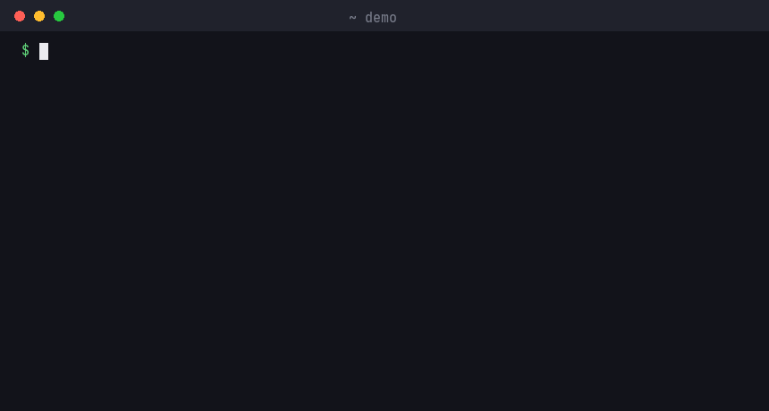

# Telepresence: Fast, Local Development for Kubernetes

 

Telepresence is a [CNCF](https://www.cncf.io/) project that connects your
workstation to a Kubernetes cluster. Code and debug a service locally — with
your own IDE, debugger, and hot reload — while it receives real traffic from
the cluster, without the container build/push/deploy cycle.

## Key Features

- **Cluster access** - Your workstation reaches cluster Services and Pods as
  if it were inside the cluster: cluster DNS, cluster IPs, no port-forwards.
- **Four attachment modes** - *Replace* the remote container, *intercept* a
  service port, *wiretap* a copy of the traffic, or *ingest* just the
  environment and volumes.
- **Traffic filtering** - Intercept only your own requests, selected by HTTP
  header or path, so a whole team can share one cluster without collisions.
- **Sidecar or node-agent** - The traffic-agent is either injected as a
  sidecar (the default), or runs as a node-hosted pod that attaches to
  workloads without modifying them: no injection, no pod restarts.
- **Remote environment, local process** - Run with the remote container's
  environment variables and volume mounts, so the code behaves like it does
  in the cluster.

## Getting Started

- [Quick Start Guide](https://telepresence.io/docs/quick-start) - Get up and running in minutes
- [Installation](https://telepresence.io/docs/install/client) - Install the Telepresence client
- [Documentation](https://telepresence.io) - Full documentation

## How It Works

When Telepresence connects, it creates a virtual network interface on your
workstation and routes cluster traffic through a traffic-manager deployed in
the cluster. Attaching to a workload adds a traffic-agent — a sidecar or a
node-agent — that hands the workload's traffic, environment, and volumes over
to your machine. See the
[architecture overview](https://telepresence.io/docs/concepts/architecture)
for the full picture.

## Community

- [CNCF Slack](https://communityinviter.com/apps/cloud-native/cncf) - Join [#telepresence-oss](https://cloud-native.slack.com/archives/C06B36KJ85P)
- [Troubleshooting](https://telepresence.io/docs/troubleshooting/) - Common issues and solutions

## Contributing

See [AGENTS.md](AGENTS.md) for build instructions, architecture overview, and development guidelines.

## License

Telepresence is licensed under the [Apache License 2.0](LICENSE).
