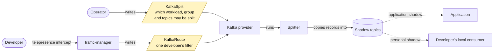
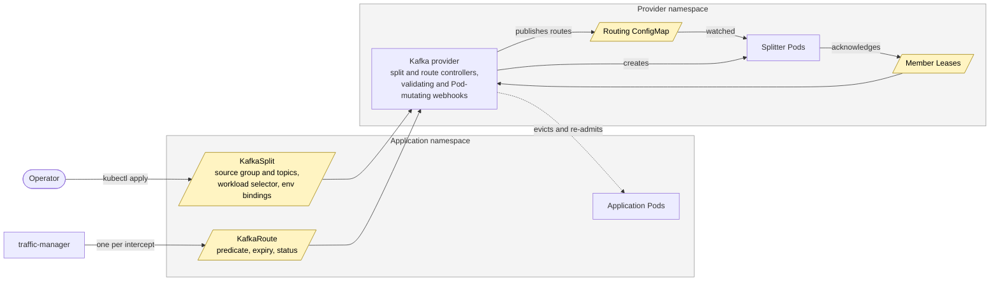
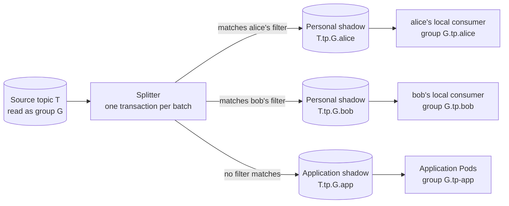
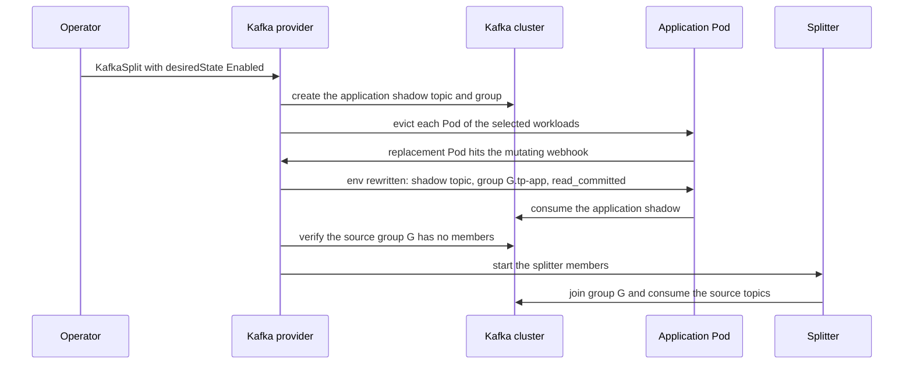
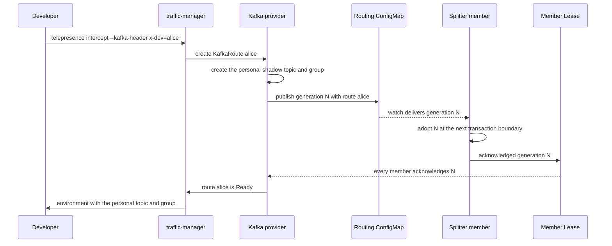

# How Kafka personal intercepts work

A Kafka personal intercept lets a developer consume, on their workstation,
only the records that match a filter, while the application in the cluster
keeps consuming everything else. This page explains the parts that make that
possible and how they fit together. The
[how-to guide](../howtos/kafka-intercepts.md) shows how to set one up, and the
[reference](../reference/kafka-intercepts.md) describes every resource,
setting, and limit.

## The big picture

The diagrams on this page use one convention. Slanted yellow boxes are
Kubernetes resources: objects stored in the cluster, like a Deployment or a
ConfigMap, that run nothing themselves. Rectangles are running programs.
Cylinders are Kafka topics. Rounded boxes are people.

`KafkaSplit` and `KafkaRoute` are custom resources of that first kind. An
operator writes one `KafkaSplit` per consumer workload to declare which
consumer group and topics may be split. A `KafkaRoute` holds one developer's
filter; nobody writes it by hand, because the traffic-manager creates it when
an intercept starts and removes it when the intercept ends. The only program
that acts on either object is the Kafka provider, a Deployment installed by
the Helm chart. It reads both, does the work, and writes status back into
them.

The work is done by the splitter, a program the provider runs for each
enabled split. It reads the source topics on behalf of the original consumer
group and copies every record to exactly one place: the personal shadow of
the route whose filter matches, or the application shadow when none does.
The application consumes its shadow, and each developer's local consumer
reads their personal shadow.

## Resources and controllers

**KafkaSplit.** A resource, one per consumer workload, that lives in the
workload's namespace. It names the source consumer group and topics, selects
the workload, and maps the Kafka settings to the environment variables the
container reads them from. Its `desiredState` field is the switch that
enables or disables the split, and its status reports what the provider has
done. The split is the unit of ownership: while it is enabled, the splitter
is the only consumer of the source group.

**KafkaRoute.** A resource, one per intercept, in the same namespace as its
split. The traffic-manager creates it when an intercept starts and removes it
when the intercept ends, so users rarely handle routes directly. A route
carries a predicate, such as a header value or a key prefix. The provider
rejects a route whose predicate could match the same record as an existing
one.

**Kafka provider.** The `tp-kafka` Deployment reconciles splits and routes,
validates them on admission, and mutates application Pods. It creates the
shadow topics and groups on the broker, runs the splitter, and reports
status on both resources. It watches Pods and workloads only in namespaces
that hold a split.

**Splitter.** The Pods of a StatefulSet that the provider creates for each
enabled split. They join the source group with static membership, so a
restarted member takes back its own partitions. The provider publishes the
active routes as a numbered generation in a ConfigMap that every member
watches, and each member records the generation it runs in a Lease that the
provider reads back.

## Where a record goes

The splitter consumes the source topics inside Kafka transactions. For each
batch it publishes every record to exactly one shadow and commits the source
offsets in the same transaction, so an aborted batch neither advances the
source group nor exposes a record to `read_committed` consumers. Records keep
their partition number, key, value, headers, and timestamp. Every shadow
mirrors the source partition count.

Filters of concurrent developers must be disjoint: no record may match two
routes. Without that rule the splitter could not publish a record to exactly
one destination.

## Enabling a split

The provider never edits the workload template. It evicts the application's
Pods, and its mutating webhook rewrites each replacement Pod's environment to
point at the application shadow. Only once the source group is provably empty
does the splitter take it over. Disabling a split runs the same steps in
reverse: routes close, the splitter drains and leaves the group, admission
returns to normal, and the Pods are replaced once more. Because a Pod admitted
without the rewrite would consume the source group next to the splitter, the
webhook refuses Pod creation in a labelled namespace while the provider is
unavailable.

## Adding a route

`telepresence intercept` attaches every enabled split that selects the
workload. The environment it provides to the local process overrides the
topic, group, and isolation-level variables with the route's personal values,
so a consumer started with that environment reads its personal shadow without
any code change. A route reports ready only once every splitter member
acknowledges the generation that contains it, so a developer never sees a
route that only part of the splitter honors.

Leaving the intercept closes the route: the splitter stops routing to it, the
records the local consumer had not yet read are drained back into the
application shadow, and the managed personal resources are removed.
