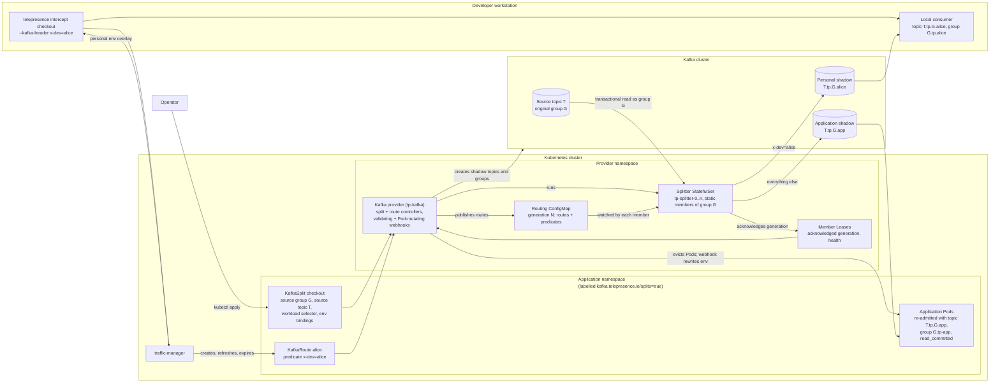

# How Kafka personal intercepts work

A Kafka personal intercept lets a developer consume, on their workstation,
only the records that match a filter, while the application in the cluster
keeps consuming everything else. This page explains the parts that make that
possible and how they fit together. The
[how-to guide](../howtos/kafka-intercepts.md) shows how to set one up, and the
[reference](../reference/kafka-intercepts.md) describes every resource,
setting, and limit.

## The parts

**KafkaSplit.** An operator declares one split per consumer workload. It names
the source consumer group and topics, selects the workload, and maps the
Kafka settings to the environment variables the container reads them from.
The split is the unit of ownership: while it is enabled, the splitter is the
only consumer of the source group.

**KafkaRoute.** Every developer's intercept becomes a route under the split.
A route carries a predicate, such as a header value or a key prefix, and the
provider rejects a route whose predicate could match the same record as an
existing one. Routes are created and expired by the traffic-manager as part
of an ordinary `telepresence intercept`, so users rarely handle them directly.

**Kafka provider.** The `tp-kafka` Deployment reconciles splits and routes,
validates them on admission, and mutates application Pods. It creates the
shadow topics and groups on the broker, runs the splitter, and reports status
on both resources.

**Splitter.** A StatefulSet whose members join the source group with static
membership and consume the source topics inside Kafka transactions. Each
record is published to exactly one destination, the matching personal shadow
or the application shadow, and the source offset is committed in the same
transaction.

**Shadows.** The application shadow receives every record that no route
claims. Each route has its own personal shadow. Both mirror the source
partition count so that partition numbers survive the copy.

## What happens to the application

The provider never edits the workload template. When a split is enabled it
evicts the application's Pods, and its mutating webhook rewrites each
replacement Pod's environment to point at the application shadow topic and
group with `read_committed` isolation. Disabling the split does the same in
reverse. Because a Pod admitted without that rewrite would consume the source
group next to the splitter, the webhook refuses Pod creation in a labelled
namespace while the provider is unavailable.

## What the developer sees

`telepresence intercept` attaches every enabled split that selects the
workload. The environment it provides to the local process overrides the
topic, group, and isolation-level variables with the route's personal values,
so a consumer started with that environment reads its personal shadow without
any code change. Leaving the intercept closes the route: the splitter stops
routing to it, the local group's lag is drained back into the application
shadow, and the managed personal resources are removed.

## How routing changes propagate

The route controller publishes the set of active routes and their predicates
as a numbered generation in a ConfigMap. Every splitter member watches that
ConfigMap and adopts a new generation at its next transaction boundary, then
records the generation it runs in its member Lease. The provider reports a
route as ready only once every member acknowledges the generation that
contains it, so a developer never sees a route that only part of the splitter
honors.
