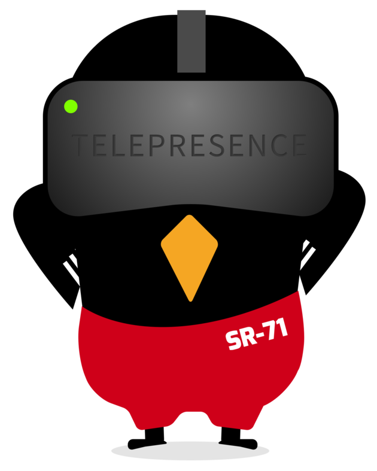

import Alert from '@material-ui/lab/Alert';
import Platform from '@src/components/Platform';
import QSCards from './qs-cards'

<div class="docs-language-toc">

* <a href="../qs-node/" title="Node.js">Node.js</a>
* <a href="../qs-go/" title="Go">Go</a>
* <a href="../qs-java/" title="Java">Java</a>
* <a href="../qs-python/" title="Python (Flask)">Python (Flask)</a>
* <a href="../qs-python-fastapi/" title="Python (FastAPI)" class="active">Python (FastAPI)</a>

</div>

# Telepresence Quick Start - **Python (FastAPI)**

<div class="docs-article-toc">
<h3>Contents</h3>

* [Prerequisites](#prerequisites)
* [1. Install the Telepresence CLI](#1-install-the-telepresence-cli)
* [2. Test Telepresence](#2-test-telepresence)
* [3. Install a sample Python application](#3-install-a-sample-python-application)
* [4. Set up a local development environment](#4-set-up-a-local-development-environment)
* [5. Intercept all traffic to the service](#5-intercept-all-traffic-to-the-service)
* [6. Make a code change](#6-make-a-code-change)
* [7. Create a Preview URL](#7-create-a-preview-url)
* [What's next?](#img-classos-logo-srcimageslogopng-whats-next)

</div>

## Prerequisites

You’ll need [`kubectl`](https://kubernetes.io/docs/tasks/tools/install-kubectl/) or `oc` installed
and set up
([Linux](https://kubernetes.io/docs/tasks/tools/install-kubectl-linux/#verify-kubectl-configuration) /
 [macOS](https://kubernetes.io/docs/tasks/tools/install-kubectl-macos/#verify-kubectl-configuration) /
 [Windows](https://kubernetes.io/docs/tasks/tools/install-kubectl-windows/#verify-kubectl-configuration))
to use a Kubernetes cluster, preferably an empty test cluster.  This
document uses `kubectl` in all example commands, but OpenShift
users should have no problem substituting in the `oc` command instead.

<Alert severity="info">
    <strong>Need a cluster?</strong> We provide free demo clusters preconfigured to follow this quick start. <a href="../demo-node/">Switch over to that version of the guide here</a>.
</Alert>

If you have used Telepresence previously, please first reset your Telepresence deployment with:
`telepresence uninstall --everything`.

## 1. Install the Telepresence CLI

<Platform.TabGroup>
<Platform.MacOSTab>

```shell
# Intel Macs

# Install via brew:
brew install datawire/blackbird/telepresence

# OR install manually:
# 1. Download the latest binary (~60 MB):
sudo curl -fL https://app.getambassador.io/download/tel2/darwin/amd64/$dlVersion$/telepresence -o /usr/local/bin/telepresence

# 2. Make the binary executable:
sudo chmod a+x /usr/local/bin/telepresence

# Apple silicon Macs

# Install via brew:
brew install datawire/blackbird/telepresence-arm64

# OR Install manually:
# 1. Download the latest binary (~60 MB):
sudo curl -fL https://app.getambassador.io/download/tel2/darwin/arm64/$dlVersion$/telepresence -o /usr/local/bin/telepresence

# 2. Make the binary executable:
sudo chmod a+x /usr/local/bin/telepresence
```

</Platform.MacOSTab>
<Platform.GNULinuxTab>

```shell
# 1. Download the latest binary (~50 MB):
sudo curl -fL https://app.getambassador.io/download/tel2/linux/amd64/$dlVersion$/telepresence -o /usr/local/bin/telepresence

# 2. Make the binary executable:
sudo chmod a+x /usr/local/bin/telepresence
```

</Platform.GNULinuxTab>
<Platform.WindowsTab>

```powershell
# Windows is in Developer Preview, here is how you can install it:
# Make sure you run the following from Powershell as Administrator
# 1. Download the latest windows zip containing telepresence.exe and its dependencies (~50 MB):
curl -fL https://app.getambassador.io/download/tel2/windows/amd64/$dlVersion$/telepresence.zip -o telepresence.zip

# 2. Unzip the zip file to a suitable directory + cleanup zip
Expand-Archive -Path telepresence.zip
Remove-Item 'telepresence.zip'
cd telepresence

# 3. Run the install-telepresence.ps1 to install telepresence's dependencies. It will install telepresence to
# C:\telepresence by default, but you can specify a custom path $path with -Path $path
Set-ExecutionPolicy Bypass -Scope Process
.\install-telepresence.ps1

# 4. Remove the unzipped directory
cd ..
Remove-Item telepresence
# 5. Close your current Powershell and open a new one. Telepresence should now be usable as telepresence.exe
```

</Platform.WindowsTab>
</Platform.TabGroup>

## 2. Test Telepresence

Telepresence connects your local workstation to a remote Kubernetes cluster.

1. Connect to the cluster:
`telepresence connect`

  ```
  $ telepresence connect

    Launching Telepresence Daemon
    ...
    Connected to context default (https://<cluster-public-IP>)
  ```

  <Alert severity="info">
    macOS users: If you receive an error when running Telepresence that the developer cannot be verified, open
    <br />
    <strong>System Preferences → Security & Privacy → General</strong>.
    <br />
    Click <strong>Open Anyway</strong> at the bottom to bypass the security block. Then retry the <code>telepresence connect</code> command.
  </Alert>

2. Test that Telepresence is working properly by connecting to the Kubernetes API server:
`curl -ik https://kubernetes.default`

  <Alert severity="info"><b>Didn't work?</b> Make sure you are using Telepresence 2.0.3 or greater, check with <code>telepresence version</code> and upgrade <a href="../../install/upgrade/">here</a> if needed.</Alert>

  ```
  $ curl -ik https://kubernetes.default

    HTTP/1.1 401 Unauthorized
    Cache-Control: no-cache, private
    Content-Type: application/json
    Www-Authenticate: Basic realm="kubernetes-master"
    Date: Tue, 09 Feb 2021 23:21:51 GMT
    Content-Length: 165

    ...

  ```
<Alert severity="info">
    The 401 response is expected.  What's important is that you were able to contact the API.
</Alert>

<Alert severity="success">
    <strong>Congratulations!</strong> You’ve just accessed your remote Kubernetes API server, as if you were on the same network! With Telepresence, you’re able to use any tool that you have locally to connect to any service in the cluster.
</Alert>

## 3. Install a sample Python application

Your local workstation may not have the compute or memory resources necessary to run all the services in a multi-service application. In this example, we’ll show you how Telepresence can give you a fast development loop, even in this situation.

<Alert severity="info">
  While Telepresence works with any language, this guide uses a sample app written in Python using the FastAPI framework. We have versions in <a href="../qs-python/">Python (Flask)</a>, <a href="../qs-go/">Go</a>, <a href="../qs-java/">Java</a>, and <a href="../qs-node/">NodeJS</a> if you prefer.
</Alert>

1. Start by installing a sample application that consists of multiple services:
`kubectl apply -f https://raw.githubusercontent.com/datawire/edgey-corp-python-fastapi/main/k8s-config/edgey-corp-web-app-no-mapping.yaml`

  ```
  $ kubectl apply -f https://raw.githubusercontent.com/datawire/edgey-corp-python-fastapi/main/k8s-config/edgey-corp-web-app-no-mapping.yaml

    deployment.apps/dataprocessingservice created
    service/dataprocessingservice created
    ...

  ```

2. Give your cluster a few moments to deploy the sample application.

  Use `kubectl get pods` to check the status of your pods:

  ```
  $ kubectl get pods

    NAME                                         READY   STATUS    RESTARTS   AGE
    verylargedatastore-855c8b8789-z8nhs          1/1     Running   0          78s
    verylargejavaservice-7dfddbc95c-696br        1/1     Running   0          78s
    dataprocessingservice-5f6bfdcf7b-qvd27       1/1     Running   0          79s
  ```

3. Once all the pods are in a `Running` state, go to the frontend service in your browser at [http://verylargejavaservice.default:8080](http://verylargejavaservice.default:8080).

4. You should see the EdgyCorp WebApp with a <strong style="color:green">green</strong> title and <strong style="color:green">green</strong> pod in the diagram.

<Alert severity="success">
  <strong>Congratulations</strong>, you can now access services running in your cluster by name from your laptop!
</Alert>

## 4. Set up a local development environment
You will now download the repo containing the services' code and run the DataProcessingService service locally. This version of the code has the UI color set to <strong style="color:blue">blue</strong> instead of <strong style="color:green">green</strong>.

<Alert severity="info">
  Confirm first that nothing is running locally on port 3000! If <code>curl localhost:3000</code> returns <code>Connection refused</code> then you should be good to go.
</Alert>

1. Clone the web app’s GitHub repo:
`git clone https://github.com/datawire/edgey-corp-python-fastapi.git`

  ```
  $ git clone https://github.com/datawire/edgey-corp-python-fastapi.git

    Cloning into 'edgey-corp-python-fastapi'...
    remote: Enumerating objects: 441, done.
    ...
  ```

2. Change into the repo directory, then into DataProcessingService:
`cd edgey-corp-python-fastapi/DataProcessingService/`

3. Install the dependencies and start the Python server.
Python 2.x: `pip install fastapi uvicorn requests && python app.py`
Python 3.x: `pip3 install fastapi uvicorn requests && python3 app.py`

  ```
  $ pip install fastapi uvicorn requests && python app.py

    Collecting fastapi
    ...
    Application startup complete.

  ```

  <Alert severity="info"><a href="https://www.python.org/downloads/">Install Python from here</a> if needed.</Alert>

4. In a **new terminal window**, curl the service running locally to confirm it’s set to <strong style="color:blue">blue</strong>:
`curl localhost:3000/color`

  ```
  $ curl localhost:3000/color

    "blue"
  ```

<Alert severity="success">
  <strong>Victory</strong>, your local service is running a-ok!
</Alert>

## 5. Intercept all traffic to the service
Next, we’ll create an intercept. An intercept is a rule that tells Telepresence where to send traffic. In this example, we will send all traffic destined for the DataProcessingService to the version of the DataProcessingService running locally instead:

1. Start the intercept with the `intercept` command, setting the service name and port:
`telepresence intercept dataprocessingservice --port 3000`

  ```
  $ telepresence intercept dataprocessingservice --port 3000

    Using Deployment dataprocessingservice
    intercepted
        Intercept name: dataprocessingservice
        State         : ACTIVE
        Workload kind : Deployment
        Destination   : 127.0.0.1:3000
        Intercepting  : all TCP connections
  ```

2. Go to the frontend service again in your browser. Since the service is now intercepted it can be reached directly by its service name at [http://verylargejavaservice:8080](http://verylargejavaservice:8080). You will now see the <strong style="color:blue">blue</strong> elements in the app.

<Alert severity="success">
  The frontend’s request to DataProcessingService is being <strong>intercepted and rerouted</strong> to the Python  server on your laptop!
</Alert>

## 6. Make a code change
We’ve now set up a local development environment for the DataProcessingService, and we’ve created an intercept that sends traffic in the cluster to our local environment. We can now combine these two concepts to show how we can quickly make and test changes.

1. Open `edgey-corp-python-fastapi/DataProcessingService/app.py` in your editor and change `DEFAULT_COLOR` on line 17 from `blue` to `orange`. Save the file and the Python server will auto reload.

2. Now, visit [http://verylargejavaservice:8080](http://verylargejavaservice:8080) again in your browser. You will now see the <span style="color:orange">orange</span> elements in the application.

<Alert severity="success">
  We’ve just shown how we can edit code locally, and <strong>immediately</strong> see these changes in the cluster.
  <br />
  Normally, this process would require a container build, push to registry, and deploy.
  <br />
  With Telepresence, these changes happen instantly.
</Alert>

## 7. Create a Preview URL

Create a personal intercept with a preview URL; meaning that only
traffic coming from the preview URL will be intercepted, so you can
easily share the services you’re working on with your teammates.

1. Clean up your previous intercept by removing it:
`telepresence leave dataprocessingservice`

2. Log in to Ambassador Cloud, a web interface for managing and
   sharing preview URLs:

   ```console
   $ telepresence login
   Launching browser authentication flow...
   <web browser opens, log in and choose your organization>
   Login successful.
   ```

   If you are in an environment where Telepresence cannot launch a
   local browser for you to interact with, you will need to pass the
   [`--apikey` flag to `telepresence
   login`](../../reference/client/login/).

3. Start the intercept again:
`telepresence intercept dataprocessingservice --port 3000`
   You will be asked for your ingress layer 3 address; specify the front end service: `verylargejavaservice.default`
   Then when asked for the port, type `8080`, for "use TLS", type `n` and finally confirm the layer 5 hostname.

  ```
    $ telepresence intercept dataprocessingservice --port 3000

      To create a preview URL, telepresence needs to know how requests enter 
	    your cluster. Please Select the ingress to use.

      1/4: What's your ingress' IP address?
           You may use an IP address or a DNS name (this is usually a
           "service.namespace" DNS name).

             [default: dataprocessingservice.default]: verylargejavaservice.default

      2/4: What's your ingress' TCP port number?

             [default: 80]: 8080

      3/4: Does that TCP port on your ingress use TLS (as opposed to cleartext)?

             [default: n]:

      4/4: If required by your ingress, specify a different hostname
           (TLS-SNI, HTTP "Host" header) to be used in requests.

             [default: verylargejavaservice.default]:

      Using Deployment dataprocessingservice
      intercepted
          Intercept name  : dataprocessingservice
          State           : ACTIVE
          Workload kind   : Deployment
          Destination     : 127.0.0.1:3000
          Intercepting    : HTTP requests that match all of:
            header("x-telepresence-intercept-id") ~= regexp("86cb4a70-c7e1-1138-89c2-d8fed7a46cae:dataprocessingservice")
          Preview URL     : https://<random-subdomain>.preview.edgestack.me
          Layer 5 Hostname: verylargejavaservice.default
  ```

4. Wait a moment for the intercept to start; it will also output a preview URL.  Go to this URL in your browser, it will be the <strong style="color:orange">orange</strong> version of the app.

5. Go again to [http://verylargejavaservice:8080](http://verylargejavaservice:8080) and it’s still <strong style="color:green">green</strong>.

Normal traffic coming to your app gets the <strong style="color:green">green</strong> cluster service, but traffic coming from the preview URL goes to your laptop and gets the <strong style="color:orange">orange</strong> local service!

<Alert severity="success">
  The <strong>Preview URL</strong> now shows exactly what is running on your local laptop -- in a way that can be securely shared with anyone you work with.
</Alert>

##  What's Next?

<QSCards/>
