# Telepresence HPA Traffic Routing: Complete Discovery & Analysis

## Executive Summary

**Key Finding**: When you create a basic Telepresence intercept on an HPA-managed deployment with multiple replicas, **ALL pods route 100% of their traffic to your local machine**, not just one pod.

This document provides a comprehensive technical analysis of how Telepresence handles traffic routing with Horizontal Pod Autoscaler (HPA), correcting previous misunderstandings and providing code-level evidence.

---

## Table of Contents

1. [Initial Misunderstanding](#initial-misunderstanding)
2. [The Truth: Confirmed by Maintainer](#the-truth-confirmed-by-maintainer)
3. [Complete Technical Analysis](#complete-technical-analysis)
4. [Code Evidence](#code-evidence)
5. [Traffic Flow Architecture](#traffic-flow-architecture)
6. [Why This Works: The Broadcast Mechanism](#why-this-works-the-broadcast-mechanism)
7. [Practical Implications](#practical-implications)
8. [Common Misconceptions Debunked](#common-misconceptions-debunked)
9. [Comparison with Previous Analysis](#comparison-with-previous-analysis)

---

## Initial Misunderstanding

### The Question

With the following setup:
- **Ingress**: `alamakota.mydomain.com` → Service
- **Service**: "myapp" with 3 pod replicas (HPA managed)
- **Basic intercept**: `telepresence intercept myapp --port 8080` (no HTTP flags)

**Question**: What percentage of traffic reaches the developer's local machine?

### Initial (INCORRECT) Analysis

❌ **Wrong Answer**: Only ~33% of traffic (traffic to one intercepted pod)

**Reasoning** (incorrect):
- Kubernetes Service load-balances to all 3 pods
- Only one pod is "intercepted"
- Therefore, only traffic hitting that pod (~33%) reaches the developer
- Other 66% goes to normal pods

---

## The Truth: Confirmed by Maintainer

### Conversation with Thomas Hallgren (Telepresence Maintainer)

**Question**: "So if we have for example 3 pods. Only one will route traffic to a local machine, right? So if I do request to bla.something.com only 33% will be routed to the intercepted pod and finally to my machine?"

**Thomas Hallgren**: "No, that's not right. **All of them will route to the local machine.**"

**Clarification**: "so all traffic agents in all pods will route traffic?"

**Thomas Hallgren**: "**yes**"

### ✅ Correct Answer

**ALL 3 pods route 100% of their traffic to the developer's local machine.**

**Traffic distribution**:
- 100% of requests reach your local machine
- Kubernetes load balancing distributes requests across all 3 pods
- Each pod that receives a request forwards it to your machine

---

## Complete Technical Analysis

### Architecture Overview

```
┌─────────────────────────────────────────────────────────────┐
│  Ingress: alamakota.mydomain.com                            │
└────────────────────────┬────────────────────────────────────┘
                         ↓
┌─────────────────────────────────────────────────────────────┐
│  Kubernetes Service: myapp                                   │
│  (UNCHANGED - continues normal load balancing)               │
└────────────────────────┬────────────────────────────────────┘
                         ↓
          ┌──────────────┼──────────────┐
          ↓              ↓              ↓
    ┌─────────┐    ┌─────────┐    ┌─────────┐
    │ Pod 1   │    │ Pod 2   │    │ Pod 3   │
    │ (myapp) │    │ (myapp) │    │ (myapp) │
    └────┬────┘    └────┬────┘    └────┬────┘
         │              │              │
         ↓              ↓              ↓
    ┌─────────┐    ┌─────────┐    ┌─────────┐
    │ Agent 1 │    │ Agent 2 │    │ Agent 3 │
    │ (inject)│    │ (inject)│    │ (inject)│
    └────┬────┘    └────┬────┘    └────┬────┘
         │              │              │
         │ All receive SAME intercept  │
         │ InterceptInfo {             │
         │   ClientSession: "abc123"   │
         │   Agent: "myapp"            │
         │   Port: 8080                │
         │ }                           │
         │              │              │
         └──────────────┼──────────────┘
                        ↓
                 ┌─────────────┐
                 │   Traffic   │
                 │   Manager   │
                 └──────┬──────┘
                        ↓ gRPC tunnel
                 ┌─────────────┐
                 │  Developer  │
                 │   Machine   │
                 │ (localhost) │
                 └─────────────┘
```

### Key Mechanisms

1. **One Intercept Object**: Traffic Manager creates ONE intercept for the entire workload
2. **Broadcast to All Agents**: All agents matching the workload name receive this intercept
3. **Shared ClientSession**: All agents forward to the same client session
4. **No Service Modification**: Kubernetes Service continues normal load balancing

---

## Code Evidence

### 1. Intercept Creation (Manager Side)

**File**: `cmd/traffic/cmd/manager/state/intercept.go`

When you run `telepresence intercept myapp --port 8080`, the Traffic Manager creates ONE intercept object:

```go
// Simplified representation
InterceptInfo {
    Id: "client-session-abc123:myapp",
    ClientSession: &rpc.SessionInfo{
        SessionId: "client-session-abc123",  // YOUR local session
    },
    Spec: &rpc.InterceptSpec{
        Name: "myapp",
        Agent: "myapp",              // Workload name (matches ALL pods)
        Namespace: "default",        // Namespace (matches ALL pods)
        ContainerPort: 8080,         // Port to intercept
        Protocol: "TCP",
        Mechanism: "tcp",
    },
    Disposition: WAITING,            // Initially waiting for agent approval
}
```

**Key Point**: `Spec.Agent = "myapp"` matches **ALL pods** in the "myapp" deployment.

---

### 2. Intercept Distribution (WatchIntercepts)

**File**: `cmd/traffic/cmd/manager/service.go:604-650`

Each agent connects and calls `WatchIntercepts` with its own session ID:

```go
func (s *service) WatchIntercepts(session *rpc.SessionInfo, stream rpc.Manager_WatchInterceptsServer) error {
    ctx := managerutil.WithSessionInfo(stream.Context(), session)
    sessionID := tunnel.SessionID(session.GetSessionId())

    var filter func(id string, info *state.Intercept) bool

    // This code runs for EACH agent (Pod 1, Pod 2, Pod 3)
    if agent := s.state.GetAgent(sessionID); agent != nil {
        filter = func(id string, info *state.Intercept) bool {
            // Check if intercept matches THIS agent's workload
            if info.Spec.Namespace != agent.Namespace ||
               info.Spec.Agent != agent.Name {
                // Different workload - don't show this intercept
                return false
            }

            // Check if agent session is still active
            if as := s.state.GetAgent(sessionID); as == nil {
                dlog.Debugf(ctx, "Session no longer active")
                return false
            }

            // Only show intercepts in agent-relevant states
            switch info.Disposition {
            case rpc.InterceptDispositionType_WAITING,
                 rpc.InterceptDispositionType_ACTIVE,
                 rpc.InterceptDispositionType_AGENT_ERROR:
                return true  // Agent should handle this
            case rpc.InterceptDispositionType_REMOVED:
                return true  // Agent should stop handling this
            default:
                return false
            }
        }
    }

    // Stream intercepts matching the filter to the agent
    snapshotCh := s.state.WatchIntercepts(ctx, filter)
    for {
        select {
        case snapshot, ok := <-snapshotCh:
            if !ok {
                return nil
            }
            // Send intercepts to agent
            intercepts := make([]*rpc.InterceptInfo, 0, len(snapshot))
            for _, intercept := range snapshot {
                intercepts = append(intercepts, intercept.InterceptInfo)
            }
            if err := stream.Send(&rpc.InterceptInfoSnapshot{
                Intercepts: intercepts,
            }); err != nil {
                return err
            }
        case <-ctx.Done():
            return nil
        }
    }
}
```

**Critical Logic**: The filter checks:
```go
if info.Spec.Agent != agent.Name {
    return false  // Different workload
}
```

**For all 3 pods in "myapp" deployment**:
- Pod 1: `agent.Name = "myapp"` → Filter passes ✓
- Pod 2: `agent.Name = "myapp"` → Filter passes ✓
- Pod 3: `agent.Name = "myapp"` → Filter passes ✓

**Result**: All 3 agents receive the SAME intercept object.

---

### 3. Agent Reception and Processing

**File**: `cmd/traffic/cmd/agent/client.go:189-205`

Each agent receives the intercept snapshot and processes it:

```go
func handleInterceptLoop(ctx context.Context, manager rpc.ManagerClient,
                         session *rpc.SessionInfo,
                         snapshots <-chan *rpc.InterceptInfoSnapshot,
                         state State) error {
    for {
        select {
        case <-ctx.Done():
            return nil
        case snapshot := <-snapshots:
            // Log what we received
            dlog.Debugf(ctx, "HandleIntercepts %s", interceptsStringer(snapshot.Intercepts))

            // Process the intercepts
            reviews := state.HandleIntercepts(ctx, snapshot.Intercepts)

            // Send review back to Traffic Manager
            for _, review := range reviews {
                review.Session = session
                if _, err := manager.ReviewIntercept(ctx, review); err != nil {
                    dlog.Errorf(ctx, "ReviewIntercept: %v", err)
                }
            }
        }
    }
}
```

**File**: `cmd/traffic/cmd/agent/state.go:140-175`

```go
func (s *state) HandleIntercepts(ctx context.Context, iis []*rpc.InterceptInfo) []*rpc.ReviewInterceptRequest {
    var rs []*rpc.ReviewInterceptRequest

    // Keep track of which intercepts were handled
    handled := make([]bool, len(iis))

    for _, ist := range s.interceptStates {
        ms := make([]*rpc.InterceptInfo, 0, len(iis))
        for i, ii := range iis {
            if !handled[i] {
                ic := ist.Target()
                // Check if this intercept matches our port/protocol
                if ic.MatchForSpec(ii.Spec) {
                    dlog.Debugf(ctx, "intercept id %s matches target port=%d",
                                ii.Id, ic.ContainerPort())
                    ms = append(ms, ii)
                    handled[i] = true
                }
            }
        }
        // Process matched intercepts for this port
        rs = append(rs, ist.HandlePort(ctx, ms)...)
    }

    return rs
}
```

**What Happens**:
1. Each agent receives `InterceptInfo` with `ContainerPort: 8080`
2. Agent checks if it has a container exposing port 8080
3. If yes, agent creates a `ReviewInterceptRequest` approving the intercept
4. Agent sends review back to Traffic Manager

---

### 4. Traffic Manager Review Processing

**File**: `cmd/traffic/cmd/manager/service.go:799-848`

Traffic Manager receives multiple `ReviewIntercept` calls (one from each agent):

```go
func (s *service) ReviewIntercept(ctx context.Context, rIReq *rpc.ReviewInterceptRequest) (*empty.Empty, error) {
    agent := s.state.GetAgent(tunnel.SessionID(rIReq.Session.SessionId))
    if agent == nil {
        return nil, status.Errorf(codes.NotFound, "agent session %q not found", rIReq.Session.SessionId)
    }

    ceptID := rIReq.Id
    intercept := s.state.UpdateIntercept(ceptID, func(intercept *state.Intercept) {
        // Only update if intercept is still WAITING
        if intercept.Disposition == rpc.InterceptDispositionType_NO_AGENT ||
           intercept.Disposition == rpc.InterceptDispositionType_WAITING {
            // FIRST agent to review sets these fields
            intercept.Disposition = rIReq.Disposition
            intercept.PodIp = rIReq.PodIp
            intercept.PodName = agent.PodName
            // ... other fields

            dlog.Infof(ctx, "Intercept %s: %s %s",
                       ceptID, agent.PodName, intercept.Disposition)
        } else {
            // SUBSEQUENT agents: disposition is already ACTIVE
            // Their reviews are effectively ignored (no update happens)
            dlog.Debugf(ctx, "Intercept %s already reviewed by another agent", ceptID)
        }
    })

    return &empty.Empty{}, nil
}
```

**Timeline**:
1. **Pod 1 Agent** reviews intercept → `Disposition: WAITING → ACTIVE`, stores Pod 1's IP
2. **Pod 2 Agent** reviews intercept → Already `ACTIVE`, no update (race condition handled)
3. **Pod 3 Agent** reviews intercept → Already `ACTIVE`, no update

**Result**: Intercept becomes `ACTIVE` after first agent reviews it.

---

### 5. Traffic Forwarding (Agent Side)

**File**: `cmd/traffic/cmd/agent/fwd/tcp.go:97-132`

When traffic arrives at ANY of the 3 pods on port 8080:

```go
func (f *tcp) Forward(ctx context.Context, clientConn net.Conn) error {
    f.mu.Lock()
    intercept, err := f.intercepts.global()  // Get active intercept for this port
    wtIntercepts := f.wiretaps.sorted()
    f.mu.Unlock()

    if err != nil {
        return err
    }

    // Handle wiretaps (copy traffic)
    if len(wtIntercepts) > 0 {
        for _, ii := range wtIntercepts {
            go f.interceptConn(conn, intercept)
        }
    }

    // If there's an active intercept, forward to client
    if intercept != nil {
        defer clientConn.Close()
        return f.interceptConn(clientConn, intercept)  // Forward to YOUR machine
    }

    // No intercept - forward to local container
    return f.Forwarder.Forward(ctx, clientConn)
}
```

**Key Method**: `f.interceptConn(clientConn, intercept)`

This creates a tunnel stream to the `ClientSession` specified in the intercept:

```go
func (f *tcp) interceptConn(clientConn net.Conn, ic *interceptController) error {
    ii := ic.InterceptInfo()

    // Create tunnel to client session
    stream, err := f.createStream(ctx, src, ii)
    if err != nil {
        return err
    }

    // Forward traffic through tunnel
    return tunnel.Pipe(clientConn, stream)
}
```

**File**: `cmd/traffic/cmd/agent/fwd/tcp.go:171-190`

```go
func (f *tcp) createStream(ctx context.Context, src netip.AddrPort, ii *manager.InterceptInfo) (tunnel.Stream, error) {
    spec := ii.Spec
    dst := netip.AddrPortFrom(parseAddr(spec.TargetHost), uint16(spec.TargetPort))
    id := tunnel.NewConnID(types.ProtoTCP, src, dst)

    // THIS IS THE KEY: ClientSession identifies YOUR local machine
    clientSession := tunnel.SessionID(ii.ClientSession.SessionId)

    // Create stream to the CLIENT (not to a specific pod)
    s, err := sp.CreateClientStream(ctx, tunnel.AgentToClient, clientSession, id, latency, timeout)
    return s, nil
}
```

**Critical Line**:
```go
clientSession := tunnel.SessionID(ii.ClientSession.SessionId)
```

**All 3 agents use the SAME `ClientSession.SessionId`** because they all received the same `InterceptInfo` object.

---

## Traffic Flow Architecture

### Complete Request Flow

```
┌─────────────────────────────────────────────────────────────────────┐
│ Step 1: User Creates Intercept                                      │
│ $ telepresence intercept myapp --port 8080                          │
└───────────────────────────────┬─────────────────────────────────────┘
                                ↓
┌─────────────────────────────────────────────────────────────────────┐
│ Step 2: Traffic Manager Creates ONE Intercept Object                │
│                                                                      │
│ InterceptInfo {                                                      │
│   Id: "client-abc123:myapp",                                        │
│   ClientSession: SessionInfo { SessionId: "client-abc123" },        │
│   Spec: {                                                           │
│     Agent: "myapp",           ← Matches ALL pods in deployment      │
│     Namespace: "default",     ← Matches ALL pods in namespace       │
│     ContainerPort: 8080,                                            │
│   },                                                                │
│   Disposition: WAITING,                                             │
│ }                                                                   │
└───────────────────────────────┬─────────────────────────────────────┘
                                ↓
┌─────────────────────────────────────────────────────────────────────┐
│ Step 3: Broadcast to All Agents via WatchIntercepts                 │
│                                                                      │
│ Filter logic (service.go:620-641):                                  │
│   if info.Spec.Agent != agent.Name → return false                   │
│                                                                      │
│ Pod 1 Agent: agent.Name = "myapp" → Filter PASSES ✓                │
│ Pod 2 Agent: agent.Name = "myapp" → Filter PASSES ✓                │
│ Pod 3 Agent: agent.Name = "myapp" → Filter PASSES ✓                │
│                                                                      │
│ All 3 agents receive InterceptInfoSnapshot{                         │
│   Intercepts: [InterceptInfo with ClientSession="client-abc123"]    │
│ }                                                                   │
└───────────────────────────────┬─────────────────────────────────────┘
                                ↓
┌─────────────────────────────────────────────────────────────────────┐
│ Step 4: Each Agent Reviews the Intercept                            │
│                                                                      │
│ Pod 1: state.HandleIntercepts() → matches port 8080 → APPROVE       │
│ Pod 2: state.HandleIntercepts() → matches port 8080 → APPROVE       │
│ Pod 3: state.HandleIntercepts() → matches port 8080 → APPROVE       │
│                                                                      │
│ Each agent sends ReviewInterceptRequest back to Traffic Manager     │
└───────────────────────────────┬─────────────────────────────────────┘
                                ↓
┌─────────────────────────────────────────────────────────────────────┐
│ Step 5: Traffic Manager Updates Intercept (First Agent Wins)        │
│                                                                      │
│ First review (Pod 1): Disposition: WAITING → ACTIVE ✓              │
│ Second review (Pod 2): Already ACTIVE, no update                    │
│ Third review (Pod 3): Already ACTIVE, no update                     │
│                                                                      │
│ Final state:                                                        │
│ InterceptInfo {                                                      │
│   Disposition: ACTIVE,                                              │
│   PodIp: "10.0.1.1",         ← Pod 1's IP (first to review)        │
│   PodName: "myapp-pod1",                                            │
│   ClientSession: "client-abc123",  ← SHARED by all agents          │
│ }                                                                   │
└───────────────────────────────┬─────────────────────────────────────┘
                                ↓
┌─────────────────────────────────────────────────────────────────────┐
│ Step 6: Traffic Arrives from Ingress                                │
│                                                                      │
│ Ingress → Service → Kubernetes Load Balancer                        │
│                                                                      │
│ Load balancer distributes:                                          │
│   - 33% of requests → Pod 1 (10.0.1.1)                             │
│   - 33% of requests → Pod 2 (10.0.1.2)                             │
│   - 33% of requests → Pod 3 (10.0.1.3)                             │
└───────────────────────────────┬─────────────────────────────────────┘
                                ↓
┌─────────────────────────────────────────────────────────────────────┐
│ Step 7: Each Pod's Agent Forwards Traffic                           │
│                                                                      │
│ Pod 1 receives request:                                             │
│   → Agent intercepts on port 8080                                   │
│   → Finds active intercept with ClientSession="client-abc123"       │
│   → Creates tunnel stream to client-abc123                          │
│   → Forwards traffic to YOUR machine ✓                             │
│                                                                      │
│ Pod 2 receives request:                                             │
│   → Agent intercepts on port 8080                                   │
│   → Finds active intercept with ClientSession="client-abc123"       │
│   → Creates tunnel stream to client-abc123                          │
│   → Forwards traffic to YOUR machine ✓                             │
│                                                                      │
│ Pod 3 receives request:                                             │
│   → Agent intercepts on port 8080                                   │
│   → Finds active intercept with ClientSession="client-abc123"       │
│   → Creates tunnel stream to client-abc123                          │
│   → Forwards traffic to YOUR machine ✓                             │
└───────────────────────────────┬─────────────────────────────────────┘
                                ↓
┌─────────────────────────────────────────────────────────────────────┐
│ Step 8: Your Local Machine Receives 100% of Traffic                 │
│                                                                      │
│ localhost:8080 receives ALL requests from ALL pods                  │
│ Total: 100% of production traffic                                   │
└─────────────────────────────────────────────────────────────────────┘
```

---

## Why This Works: The Broadcast Mechanism

### Key Design Decisions

1. **Workload-Level Intercepts, Not Pod-Level**
   - Intercept targets a **workload** (Deployment/StatefulSet)
   - NOT a specific pod
   - `Spec.Agent = "myapp"` matches ALL pods in the workload

2. **Shared ClientSession**
   - ONE `ClientSession` per intercepting developer
   - ALL agents forward to the same `ClientSession`
   - The session is the tunnel endpoint, not a specific pod

3. **Filter by Workload Name**
   - `WatchIntercepts` filter: `info.Spec.Agent == agent.Name`
   - All pods with same `Name` receive the intercept
   - This is what enables the broadcast

4. **Race Condition Handling**
   - Multiple agents review the same intercept
   - First agent's review "wins" (sets PodIp, PodName)
   - Subsequent reviews are ignored (no-op)
   - All agents still forward traffic regardless

---

## Practical Implications

### What This Means for Users

✅ **100% Traffic Coverage**
- You receive ALL production traffic hitting the service
- No sampling or partial interception
- Complete debugging and testing capability

✅ **No Service Modification Required**
- Kubernetes Service continues normal load balancing
- No changes to Ingress, Service, or Endpoints
- Infrastructure remains untouched

✅ **HPA-Compatible**
- Works seamlessly with HPA scaling
- Pods scale up/down without breaking intercept
- New pods automatically join the intercept

✅ **Multiple Replicas Not a Problem**
- Having 3, 5, or 10 replicas doesn't matter
- All replicas forward to your machine
- Horizontal scaling doesn't reduce traffic percentage

### Bandwidth Considerations

With 3 pods receiving equal traffic:
- Each pod forwards ~33% of total traffic to you
- But YOU receive 100% total (sum of all pods)
- Your machine must handle full production load
- Network bandwidth between cluster and your machine matters

### Performance Impact

**Positive**:
- All traffic goes through your local code
- Complete testing of your changes

**Negative**:
- Your local machine becomes a bottleneck
- Response time = your machine's processing time + network latency
- Production users experience your local performance

---

## Common Misconceptions Debunked

### ❌ Misconception 1: "Only One Pod is Intercepted"

**Reality**: All pods matching the workload name are intercepted.

**Why the confusion**: The `PodIp` and `PodName` fields in the intercept only store one pod's info (the first to review), but this doesn't mean only that pod forwards traffic.

---

### ❌ Misconception 2: "Only 33% Traffic with 3 Pods"

**Reality**: 100% of traffic reaches your machine because all 3 pods forward their traffic.

**Why the confusion**: Kubernetes load balancing gives each pod 33%, but all 33% portions are forwarded to the same destination (your machine).

---

### ❌ Misconception 3: "Service Selector is Modified"

**Reality**: Service selector remains unchanged. No Kubernetes resources are modified.

**Why the confusion**: To route 100% traffic to one pod via Service changes would require selector modification, but Telepresence doesn't do this.

---

### ❌ Misconception 4: "Need --route-all Flag"

**Reality**: Basic intercept (`telepresence intercept myapp --port 8080`) already routes all traffic. No special flag needed.

**Why the confusion**: Documentation about "route all" strategies implied the default behavior was partial routing.

---

## Comparison with Previous Analysis

### What Was Wrong in Initial Analysis

**File Reference**: `/Users/blazej.gruszka/projects/dinocoders/telepresence/docs/reference/telepresence-route-all-traffic-approaches.md`

This document proposed 15 approaches to "route all traffic to intercepted pod," implying this wasn't the default behavior.

**Errors**:
1. Assumed only one pod was intercepted
2. Calculated ~33% traffic reaching developer
3. Proposed complex solutions for a problem that doesn't exist
4. Misunderstood the agent broadcast mechanism

### What Was Correct

✅ Code references were accurate
✅ Traffic Manager architecture understanding was correct
✅ Agent injection mechanism was understood
✅ The question about HPA compatibility was valid

### What Caused the Confusion

**Line 775-786 in `cmd/traffic/cmd/manager/state/intercept.go`**:

```go
for _, a := range snapshot {
    if mm.IsInactive(k8sTypes.UID(a.PodUid)) {
        // Agent is blacklisted
    } else {
        as = append(as, a)
        break  // ← This break was misinterpreted
    }
}
```

**Misinterpretation**: "The `break` means only one agent is selected for the intercept."

**Reality**: This code is in `waitForAgents()`, which waits for AT LEAST ONE agent to be ready before proceeding. It's not selecting which agents participate in the intercept - it's just checking readiness during setup.

---

## Validation and Testing

### How to Verify This Behavior

1. **Deploy a test service with HPA**:
   ```bash
   kubectl create deployment myapp --image=nginx --replicas=3
   kubectl expose deployment myapp --port=80 --target-port=80
   kubectl autoscale deployment myapp --min=3 --max=10
   ```

2. **Create intercept**:
   ```bash
   telepresence connect
   telepresence intercept myapp --port 80
   ```

3. **Run local service with logging**:
   ```bash
   # Simple Python server that logs all requests
   python3 -m http.server 80
   ```

4. **Generate traffic**:
   ```bash
   # From another terminal, send 100 requests
   for i in {1..100}; do
     curl http://myapp.default.svc.cluster.local
   done
   ```

5. **Verify**:
   - Check your local server logs
   - You should see 100 requests (100% of traffic)
   - Not 33 requests (~33% with 3 pods)

### Expected vs. Actual Results

| Scenario | Previous Understanding | Actual Behavior |
|----------|----------------------|-----------------|
| 3 pods, 100 requests | ~33 requests to local | 100 requests to local |
| 5 pods, 100 requests | ~20 requests to local | 100 requests to local |
| 10 pods, 100 requests | ~10 requests to local | 100 requests to local |

**Conclusion**: Number of replicas doesn't affect the percentage of traffic you receive.

---

## Technical Deep Dive: The Filter Logic

### Understanding the WatchIntercepts Filter

**File**: `cmd/traffic/cmd/manager/service.go:619-642`

```go
if agent := s.state.GetAgent(sessionID); agent != nil {
    filter = func(id string, info *state.Intercept) bool {
        // Filter condition 1: Match namespace
        if info.Spec.Namespace != agent.Namespace {
            return false
        }

        // Filter condition 2: Match workload name
        if info.Spec.Agent != agent.Name {
            return false
        }

        // Filter condition 3: Agent session is still active
        if as := s.state.GetAgent(sessionID); as == nil {
            return false
        }

        // Filter condition 4: Intercept is in relevant state
        switch info.Disposition {
        case rpc.InterceptDispositionType_WAITING,
             rpc.InterceptDispositionType_ACTIVE,
             rpc.InterceptDispositionType_AGENT_ERROR:
            return true
        case rpc.InterceptDispositionType_REMOVED:
            return true
        default:
            return false
        }
    }
}
```

### Why This Filter Enables Broadcast

**Given**:
- Intercept created with `Spec.Agent = "myapp"`, `Spec.Namespace = "default"`
- Three pods: myapp-pod1, myapp-pod2, myapp-pod3
- All in `default` namespace
- All have `Name = "myapp"` (from Deployment)

**Filter Evaluation**:

**For Pod 1 Agent**:
```
agent.Name = "myapp"
agent.Namespace = "default"

Condition 1: "default" == "default" ✓
Condition 2: "myapp" == "myapp" ✓
Condition 3: Agent session active ✓
Condition 4: Disposition is ACTIVE ✓

Result: PASS → Intercept sent to Pod 1
```

**For Pod 2 Agent**:
```
agent.Name = "myapp"
agent.Namespace = "default"

Condition 1: "default" == "default" ✓
Condition 2: "myapp" == "myapp" ✓
Condition 3: Agent session active ✓
Condition 4: Disposition is ACTIVE ✓

Result: PASS → Intercept sent to Pod 2
```

**For Pod 3 Agent**:
```
agent.Name = "myapp"
agent.Namespace = "default"

Condition 1: "default" == "default" ✓
Condition 2: "myapp" == "myapp" ✓
Condition 3: Agent session active ✓
Condition 4: Disposition is ACTIVE ✓

Result: PASS → Intercept sent to Pod 3
```

**Conclusion**: The filter matches ALL agents with the same workload name.

---

## Summary

### Key Takeaways

1. **All pods forward to your machine** - Not just one pod
2. **100% traffic coverage** - You receive all production requests
3. **No Kubernetes modifications needed** - Service, Ingress unchanged
4. **HPA-compatible by design** - Works with any number of replicas
5. **Workload-level interception** - Targets deployment, not individual pods
6. **Shared ClientSession** - All agents forward to same tunnel endpoint

### Architectural Brilliance

Telepresence's design elegantly solves the "route all traffic" problem without:
- Modifying Kubernetes Services
- Changing Ingress rules
- Manipulating Endpoints
- Scaling down pods
- Complex routing logic

Instead, it uses a simple broadcast mechanism where:
- ONE intercept object is created
- Distributed to ALL agents matching the workload
- ALL agents forward to the SAME client session

This is why **"route all traffic to intercepted pod" is the default behavior**, not something requiring special configuration or additional approaches.

---

## Complete Code Flow Diagram

This comprehensive Mermaid diagram shows the entire code flow for HPA intercept, including all key functions, file locations, and data structures:

```mermaid
flowchart TB
    subgraph "Developer Machine"
        CLI["telepresence intercept myapp --port 8080<br/><br/>cmd/telepresence/main.go"]
        LocalServer["Local Server<br/>localhost:8080"]
        ClientDaemon["Client Daemon<br/><br/>pkg/client/daemon.go"]
    end

    subgraph "Traffic Manager Pod (Cluster)"
        TM["Traffic Manager<br/><br/>cmd/traffic/cmd/manager/"]

        subgraph "Intercept Creation"
            CreateIntercept["CreateIntercept()<br/><br/>service.go:500-550"]
            InterceptState["state.Intercept<br/><br/>state/intercept.go"]
            InterceptStore["Intercept Storage<br/>map[string]*Intercept"]
        end

        subgraph "WatchIntercepts RPC"
            WatchLoop["WatchIntercepts()<br/><br/>service.go:600-650"]
            FilterLogic["Filter Logic<br/><br/>Lines 618-649<br/><br/>if info.Spec.Agent == agent.Name"]
            SendSnapshot["Send InterceptInfoSnapshot<br/>via gRPC stream"]
        end

        subgraph "Agent Registration"
            AgentRegistry["Agent Registry<br/>map[SessionID]*Agent<br/><br/>state/agent.go"]
            GetAgent["GetAgent(sessionID)<br/><br/>Returns agent with:<br/>- Name: 'myapp'<br/>- Namespace: 'default'"]
        end
    end

    subgraph "Pod 1 (myapp-abc123)"
        subgraph "Agent 1"
            Agent1["Traffic Agent 1<br/><br/>cmd/traffic/cmd/agent/"]
            Session1["SessionInfo<br/>SessionId: 'session-xyz'<br/>Name: 'myapp'<br/>Namespace: 'default'"]

            WatchClient1["WatchIntercepts Client<br/><br/>client.go:189-205<br/><br/>handleInterceptLoop()"]
            SnapshotChan1["snapshots chan<br/><InterceptInfoSnapshot>"]

            StateHandler1["state.HandleIntercepts()<br/><br/>state.go:140-175<br/><br/>Matches intercept to ports"]
            InterceptStates1["interceptStates<br/>[]interceptState"]

            Forwarder1["TCP Forwarder<br/><br/>fwd/tcp.go:97-132"]
            InterceptConn1["interceptConn()<br/><br/>Forwards to ClientSession"]
        end

        AppContainer1["App Container<br/>Port 8080"]
    end

    subgraph "Pod 2 (myapp-def456)"
        subgraph "Agent 2"
            Agent2["Traffic Agent 2<br/><br/>cmd/traffic/cmd/agent/"]
            Session2["SessionInfo<br/>SessionId: 'session-xyz'<br/>Name: 'myapp'<br/>Namespace: 'default'"]

            WatchClient2["WatchIntercepts Client<br/><br/>client.go:189-205"]
            SnapshotChan2["snapshots chan<br/><InterceptInfoSnapshot>"]

            StateHandler2["state.HandleIntercepts()<br/><br/>state.go:140-175"]
            InterceptStates2["interceptStates<br/>[]interceptState"]

            Forwarder2["TCP Forwarder<br/><br/>fwd/tcp.go:97-132"]
            InterceptConn2["interceptConn()"]
        end

        AppContainer2["App Container<br/>Port 8080"]
    end

    subgraph "Pod 3 (myapp-ghi789)"
        subgraph "Agent 3"
            Agent3["Traffic Agent 3<br/><br/>cmd/traffic/cmd/agent/"]
            Session3["SessionInfo<br/>SessionId: 'session-xyz'<br/>Name: 'myapp'<br/>Namespace: 'default'"]

            WatchClient3["WatchIntercepts Client<br/><br/>client.go:189-205"]
            SnapshotChan3["snapshots chan<br/><InterceptInfoSnapshot>"]

            StateHandler3["state.HandleIntercepts()<br/><br/>state.go:140-175"]
            InterceptStates3["interceptStates<br/>[]interceptState"]

            Forwarder3["TCP Forwarder<br/><br/>fwd/tcp.go:97-132"]
            InterceptConn3["interceptConn()"]
        end

        AppContainer3["App Container<br/>Port 8080"]
    end

    subgraph "Kubernetes Service"
        Svc["Service: myapp<br/>Load Balancer<br/>(Round-robin)"]
        Ingress["Ingress<br/>alamakota.mydomain.com"]
    end

    subgraph "Data Structures (rpc/manager.proto)"
        InterceptInfo["InterceptInfo<br/>- Id: 'intercept-id'<br/>- Spec.Agent: 'myapp'<br/>- Spec.Namespace: 'default'<br/>- ClientSession.SessionId: 'session-xyz'"]
        InterceptSpec["InterceptSpec<br/>- Agent: 'myapp' ← WORKLOAD NAME<br/>- Namespace: 'default'<br/>- PortIdentifier: '8080'"]
    end

    %% CLI to Manager
    CLI -->|"CreateIntercept RPC<br/>(workload='myapp')"| CreateIntercept
    CreateIntercept -->|"Store intercept"| InterceptStore
    InterceptStore --> InterceptState

    %% Agent Registration
    Agent1 -->|"ArriveAsAgent RPC<br/>with SessionInfo"| AgentRegistry
    Agent2 -->|"ArriveAsAgent RPC<br/>with SessionInfo"| AgentRegistry
    Agent3 -->|"ArriveAsAgent RPC<br/>with SessionInfo"| AgentRegistry

    %% WatchIntercepts Setup
    WatchClient1 -->|"WatchIntercepts RPC<br/>stream opened"| WatchLoop
    WatchClient2 -->|"WatchIntercepts RPC<br/>stream opened"| WatchLoop
    WatchClient3 -->|"WatchIntercepts RPC<br/>stream opened"| WatchLoop

    %% Filter Logic (THE KEY!)
    WatchLoop -->|"Get agent from registry"| GetAgent
    GetAgent -->|"agent.Name = 'myapp'"| FilterLogic
    InterceptStore -->|"For each intercept"| FilterLogic

    FilterLogic -->|"CHECK:<br/>info.Spec.Agent ('myapp')<br/>== agent.Name ('myapp')<br/>✓ MATCH!"| SendSnapshot

    %% Broadcast to ALL agents
    SendSnapshot -->|"Send InterceptInfoSnapshot"| SnapshotChan1
    SendSnapshot -->|"Send InterceptInfoSnapshot"| SnapshotChan2
    SendSnapshot -->|"Send InterceptInfoSnapshot"| SnapshotChan3

    %% Agent Processing
    SnapshotChan1 -->|"Receive snapshot"| StateHandler1
    SnapshotChan2 -->|"Receive snapshot"| StateHandler2
    SnapshotChan3 -->|"Receive snapshot"| StateHandler3

    StateHandler1 -->|"Match to port 8080"| InterceptStates1
    StateHandler2 -->|"Match to port 8080"| InterceptStates2
    StateHandler3 -->|"Match to port 8080"| InterceptStates3

    InterceptStates1 --> Forwarder1
    InterceptStates2 --> Forwarder2
    InterceptStates3 --> Forwarder3

    %% Traffic Flow
    Ingress -->|"100% traffic"| Svc
    Svc -->|"~33% traffic"| AppContainer1
    Svc -->|"~33% traffic"| AppContainer2
    Svc -->|"~33% traffic"| AppContainer3

    AppContainer1 -.->|"Intercepted by sidecar"| Forwarder1
    AppContainer2 -.->|"Intercepted by sidecar"| Forwarder2
    AppContainer3 -.->|"Intercepted by sidecar"| Forwarder3

    %% All forward to SAME ClientSession
    Forwarder1 -->|"Forward to ClientSession<br/>session-xyz via gRPC"| InterceptConn1
    Forwarder2 -->|"Forward to ClientSession<br/>session-xyz via gRPC"| InterceptConn2
    Forwarder3 -->|"Forward to ClientSession<br/>session-xyz via gRPC"| InterceptConn3

    InterceptConn1 -->|"Tunnel to developer"| ClientDaemon
    InterceptConn2 -->|"Tunnel to developer"| ClientDaemon
    InterceptConn3 -->|"Tunnel to developer"| ClientDaemon

    ClientDaemon -->|"Forward to local port"| LocalServer

    %% Data structure references
    InterceptInfo -.->|"Contains"| InterceptSpec
    InterceptSpec -.->|"Agent name matches<br/>ALL pods in workload"| FilterLogic

    style FilterLogic fill:#ff9999,stroke:#ff0000,stroke-width:4px
    style SendSnapshot fill:#99ff99,stroke:#00ff00,stroke-width:4px
    style InterceptSpec fill:#ffff99,stroke:#ffaa00,stroke-width:3px
    style LocalServer fill:#9999ff,stroke:#0000ff,stroke-width:3px
```



### Key Code Locations in Diagram

1. **Filter Logic (THE CRITICAL CODE)**: `cmd/traffic/cmd/manager/service.go:618-649`
   - Checks: `info.Spec.Agent == agent.Name`
   - This matches ALL pods because they all have `agent.Name = "myapp"`

2. **Agent Registration**: `cmd/traffic/cmd/manager/state/agent.go`
   - All 3 agents register with `Name: "myapp"` (workload name)

3. **Intercept Handling**: `cmd/traffic/cmd/agent/client.go:189-205`
   - `handleInterceptLoop()` receives snapshots via channel

4. **State Matching**: `cmd/traffic/cmd/agent/state.go:140-175`
   - `HandleIntercepts()` matches intercept to container ports

5. **Traffic Forwarding**: `cmd/traffic/cmd/agent/fwd/tcp.go:97-132`
   - `interceptConn()` forwards to ClientSession tunnel

6. **Data Structures**: `rpc/manager.proto`
   - `InterceptSpec.Agent` contains workload name, not pod name
   - `ClientSession.SessionId` is the same for all agents

### Why This Diagram Matters

This diagram visually proves:
- ✅ **One filter matches ALL agents** (same `agent.Name`)
- ✅ **Same intercept broadcasted to 3 agents** (via WatchIntercepts)
- ✅ **All agents forward to SAME ClientSession** (same `SessionId`)
- ✅ **Result: 100% traffic to developer** (all paths converge)

---

## References

### Key Source Files

| File | Purpose |
|------|---------|
| `cmd/traffic/cmd/manager/service.go` | WatchIntercepts RPC, filter logic |
| `cmd/traffic/cmd/manager/state/intercept.go` | Intercept creation and management |
| `cmd/traffic/cmd/agent/client.go` | Agent intercept watch loop |
| `cmd/traffic/cmd/agent/state.go` | Agent intercept handling |
| `cmd/traffic/cmd/agent/fwd/tcp.go` | Traffic forwarding to client |
| `rpc/manager/manager.proto` | Protocol definitions |

### Related Documentation

- Telepresence Architecture: `docs/reference/architecture.md`
- HPA + Ingress Diagrams: `docs/reference/telepresence-hpa-ingress-diagrams.md`
- ~~Route All Traffic Approaches~~ (now superseded): `docs/reference/telepresence-route-all-traffic-approaches.md`

---

*Document created: 2025-01-27*
*Last updated: 2025-01-27*
*For Telepresence v2.25.x+*
*Analysis confirmed by Thomas Hallgren (Telepresence Maintainer)*
