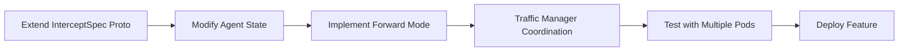
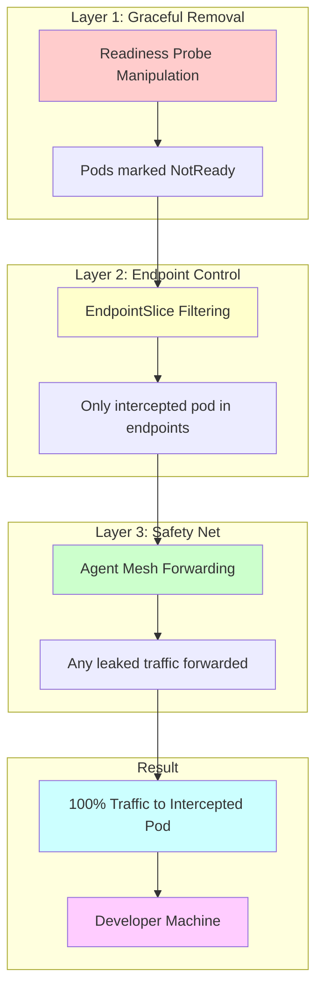
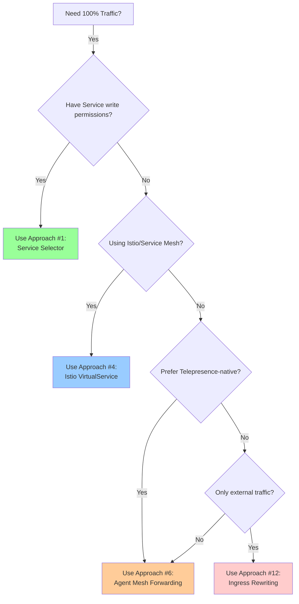

# Telepresence: Route All Traffic to Intercepted Pod

## Overview

This document explores 15 different approaches for routing 100% of traffic to a single intercepted pod when using Telepresence with HPA-scaled deployments. By default, Kubernetes load balances traffic across all healthy pod replicas, which means only a fraction of traffic reaches the intercepted pod (e.g., 33% with 3 replicas).

## Problem Statement

### Current Behavior

When you have a deployment with multiple replicas managed by HPA:

```
Ingress → Service → Load Balances to ALL pods
              ↓
    ┌─────────┼─────────┐
    ↓         ↓         ↓
  Pod A    Pod B      Pod C
 (normal) (INTERCEPTED) (normal)
    ↓         ↓         ↓
  33%       33%       33%
           ↓
    Developer Machine
```

**Result**: Only ~33% of traffic reaches your local development environment.

### Desired Behavior

Route ALL traffic (100%) to the intercepted pod:

```
Ingress → Service → Routes ONLY to intercepted pod
              ↓
           Pod B (INTERCEPTED)
              ↓
           100%
              ↓
    Developer Machine
```

### Use Cases

1. **Debugging Production Issues**: Need to see ALL traffic, not just a sample
2. **End-to-End Testing**: Test complete user flows without traffic splitting
3. **Performance Profiling**: Accurate profiling requires full traffic load
4. **State Management**: Applications with in-memory state need consistent routing
5. **Session Debugging**: Debug specific user sessions that may not hit intercepted pod

## Evaluation Criteria

Each approach is evaluated on:

- **Complexity**: Implementation difficulty (🟢 Easy, 🟡 Medium, 🔴 Hard)
- **Invasiveness**: How much it modifies Kubernetes resources
- **Reliability**: Consistency and predictability (⭐ = 1-5 stars)
- **Performance**: Latency and throughput impact (⭐ = 1-5 stars)
- **Permissions**: Kubernetes RBAC requirements
- **Reversibility**: How easily it can be undone

---

## Approach 1: Service Selector Manipulation 🏆

### Concept

Temporarily modify the Kubernetes Service selector to only match the intercepted pod by adding a unique label.

### How It Works

```yaml
# Step 1: Before intercept - Service selects all pods
apiVersion: v1
kind: Service
metadata:
  name: myapp
spec:
  selector:
    app: myapp        # Matches all 3 pods
  ports:
  - port: 80
    targetPort: 8080

# Step 2: During intercept - Add unique label to intercepted pod
apiVersion: v1
kind: Pod
metadata:
  name: myapp-abc-intercepted
  labels:
    app: myapp
    telepresence.intercept: active-xyz  # Unique label added

# Step 3: Modify Service selector to include unique label
apiVersion: v1
kind: Service
metadata:
  name: myapp
spec:
  selector:
    app: myapp
    telepresence.intercept: active-xyz  # Now only matches intercepted pod
  ports:
  - port: 80
    targetPort: 8080
```

### Implementation Steps

1. **On intercept start**:
   ```bash
   # Add unique label to intercepted pod
   kubectl label pod myapp-abc telepresence.intercept=active-xyz

   # Backup original Service selector
   kubectl get svc myapp -o yaml > myapp-service-backup.yaml

   # Patch Service selector
   kubectl patch svc myapp -p '{"spec":{"selector":{"telepresence.intercept":"active-xyz"}}}'
   ```

2. **On intercept end**:
   ```bash
   # Restore original Service selector
   kubectl apply -f myapp-service-backup.yaml

   # Remove unique label from pod
   kubectl label pod myapp-abc telepresence.intercept-
   ```

### Pros

✅ **Native Kubernetes behavior** - Uses standard Service selector mechanism
✅ **100% guaranteed routing** - Service only has one endpoint
✅ **Works with any Ingress/LoadBalancer** - No special ingress controller needed
✅ **Clean and reversible** - Simple restore from backup
✅ **Easy to debug** - `kubectl get svc myapp -o yaml` shows clear state
✅ **No extra network hops** - Direct routing

### Cons

⚠️ **Requires Service write permissions** - Need RBAC for Service updates
⚠️ **May trigger service IP changes** - Some CNI plugins may reassign ClusterIP
⚠️ **Visible change in cluster** - Auditable in cluster events
⚠️ **Deployment controller may fight** - If selector is managed by GitOps
⚠️ **Brief traffic disruption** - During selector update (typically < 1s)

### Complexity

🟢 **Medium**

### Performance Impact

⭐⭐⭐⭐⭐ (No performance overhead)

### Reliability

⭐⭐⭐⭐⭐ (Highly reliable)

### Recommended For

- Production debugging with proper change control
- Teams with Service modification permissions
- When 100% traffic guarantee is critical

### Source Code References

- Service watching: `cmd/traffic/cmd/manager/mutator/service_watcher.go`
- Intercept command: `pkg/client/cli/intercept/command.go`

---

## Approach 2: EndpointSlice Surgery

### Concept

Directly manipulate Kubernetes EndpointSlices to remove non-intercepted pod IPs, leaving only the intercepted pod as a valid endpoint.

### How It Works

```yaml
# Step 1: Before intercept - EndpointSlice has all pods
apiVersion: discovery.k8s.io/v1
kind: EndpointSlice
metadata:
  name: myapp-abc123
  labels:
    kubernetes.io/service-name: myapp
addressType: IPv4
endpoints:
- addresses: ["10.0.1.1"]  # Pod A
  conditions: {ready: true}
- addresses: ["10.0.1.2"]  # Pod B (INTERCEPTED)
  conditions: {ready: true}
- addresses: ["10.0.1.3"]  # Pod C
  conditions: {ready: true}
ports:
- port: 8080
  protocol: TCP

# Step 2: During intercept - Surgically remove non-intercepted endpoints
apiVersion: discovery.k8s.io/v1
kind: EndpointSlice
metadata:
  name: myapp-abc123
  labels:
    kubernetes.io/service-name: myapp
    endpointslice.kubernetes.io/managed-by: telepresence  # Take ownership
addressType: IPv4
endpoints:
- addresses: ["10.0.1.2"]  # Only intercepted pod remains
  conditions: {ready: true}
ports:
- port: 8080
  protocol: TCP
```

### Implementation Steps

1. **On intercept start**:
   ```bash
   # Backup existing EndpointSlices
   kubectl get endpointslices -l kubernetes.io/service-name=myapp -o yaml > endpoints-backup.yaml

   # Identify intercepted pod IP
   INTERCEPT_POD_IP=$(kubectl get pod myapp-abc -o jsonpath='{.status.podIP}')

   # Patch EndpointSlice to only include intercepted pod
   kubectl patch endpointslice myapp-abc123 --type=json -p="[
     {\"op\": \"replace\", \"path\": \"/endpoints\", \"value\": [
       {\"addresses\": [\"$INTERCEPT_POD_IP\"], \"conditions\": {\"ready\": true}}
     ]}
   ]"

   # Add annotation to prevent controller reconciliation
   kubectl annotate endpointslice myapp-abc123 endpointslice.kubernetes.io/managed-by=telepresence
   ```

2. **On intercept end**:
   ```bash
   # Restore original EndpointSlices
   kubectl apply -f endpoints-backup.yaml
   ```

### Pros

✅ **Service definition unchanged** - Service YAML remains untouched
✅ **Immediate effect on kube-proxy** - Fast propagation to iptables/ipvs
✅ **Works with all load balancers** - Standard Kubernetes mechanism
✅ **Less visible than Service changes** - Endpoints are more transient

### Cons

⚠️ **EndpointSlice controller may fight changes** - Controller tries to reconcile
⚠️ **Need to suppress controller reconciliation** - Annotation may not always work
⚠️ **More fragile than Service manipulation** - Controllers constantly update endpoints
⚠️ **Kubernetes version dependent** - EndpointSlice API is beta (stable in 1.21+)
⚠️ **Brief inconsistency possible** - During controller reconciliation loops

### Complexity

🟡 **Medium-Hard**

### Performance Impact

⭐⭐⭐⭐⭐ (No performance overhead)

### Reliability

⭐⭐⭐⭐ (Reliable but controller may fight)

### Recommended For

- When Service modification is not allowed
- Teams with EndpointSlice write permissions
- Temporary/short-lived intercepts

### Source Code References

- Endpoint tracking: `cmd/traffic/cmd/manager/state/workload_info_watcher.go`

---

## Approach 3: Label Masking

### Concept

Temporarily remove or rename labels on non-intercepted pods so the Service selector no longer matches them, leaving only the intercepted pod selected.

### How It Works

```yaml
# Service selector stays the same
apiVersion: v1
kind: Service
metadata:
  name: myapp
spec:
  selector:
    app: myapp      # Unchanged
    version: v1     # Unchanged
  ports:
  - port: 80

# Step 1: Non-intercepted pods - Rename labels
apiVersion: v1
kind: Pod
metadata:
  name: myapp-abc
  labels:
    app: myapp-disabled   # Renamed from "myapp"
    version: v1
    telepresence.backup-app: myapp  # Store original value

apiVersion: v1
kind: Pod
metadata:
  name: myapp-xyz
  labels:
    app: myapp-disabled   # Renamed from "myapp"
    version: v1
    telepresence.backup-app: myapp

# Step 2: Intercepted pod - Keep original labels
apiVersion: v1
kind: Pod
metadata:
  name: myapp-def-intercepted
  labels:
    app: myapp      # Still matches Service selector
    version: v1
    telepresence.intercept: active
```

### Implementation Steps

1. **On intercept start**:
   ```bash
   # Get all pods in deployment except intercepted pod
   NON_INTERCEPT_PODS=$(kubectl get pods -l app=myapp \
     --field-selector metadata.name!=myapp-def-intercepted -o name)

   # For each non-intercepted pod, mask the app label
   for pod in $NON_INTERCEPT_PODS; do
     # Backup original label
     kubectl label $pod telepresence.backup-app=myapp

     # Rename app label to disable Service matching
     kubectl label $pod app=myapp-disabled --overwrite
   done
   ```

2. **On intercept end**:
   ```bash
   # Restore labels on all pods
   for pod in $(kubectl get pods -l telepresence.backup-app=myapp -o name); do
     # Restore original label
     kubectl label $pod app=myapp --overwrite

     # Remove backup label
     kubectl label $pod telepresence.backup-app-
   done
   ```

### Pros

✅ **No Service modification** - Service YAML stays pristine
✅ **Reversible via label restore** - Simple undo mechanism
✅ **Works with any Kubernetes version** - Uses core label functionality
✅ **Pod-level granular control** - Can selectively enable/disable pods

### Cons

⚠️ **Pod controller may recreate pods** - ReplicaSet may see label change as pod failure
⚠️ **Deployment may fight back** - Controller tries to restore labels from template
⚠️ **Needs pod update permissions** - RBAC for pod modifications
⚠️ **Race conditions possible** - Multiple controllers modifying labels
⚠️ **May trigger pod eviction** - Label changes can trigger admission webhooks

### Complexity

🟢 **Medium**

### Performance Impact

⭐⭐⭐⭐⭐ (No performance overhead)

### Reliability

⭐⭐⭐ (Controllers may interfere)

### Recommended For

- Testing and development environments
- When both Service and Endpoint modifications are restricted
- Short-lived intercepts

### Source Code References

- Label handling: `pkg/k8sapi/object.go`
- Pod eviction: `cmd/traffic/cmd/manager/mutator/eviction.go`

---

## Approach 4: Istio VirtualService

### Concept

Use Istio's powerful traffic management capabilities to route 100% of traffic to a specific pod subset using VirtualService and DestinationRule.

### How It Works

```yaml
# Step 1: Add subset labels to pods
apiVersion: v1
kind: Pod
metadata:
  name: myapp-def-intercepted
  labels:
    app: myapp
    version: v1
    telepresence.subset: intercepted  # Subset identifier

# Step 2: Create DestinationRule with subsets
apiVersion: networking.istio.io/v1beta1
kind: DestinationRule
metadata:
  name: myapp-subsets
  namespace: default
spec:
  host: myapp.default.svc.cluster.local
  subsets:
  - name: intercepted
    labels:
      telepresence.subset: intercepted
  - name: normal
    labels:
      app: myapp
    # Don't include telepresence.subset label

# Step 3: Create VirtualService to route all traffic to intercepted subset
apiVersion: networking.istio.io/v1beta1
kind: VirtualService
metadata:
  name: myapp-intercept
  namespace: default
spec:
  hosts:
  - myapp.default.svc.cluster.local
  http:
  - match:
    - uri:
        prefix: "/"  # Match all requests
    route:
    - destination:
        host: myapp.default.svc.cluster.local
        subset: intercepted
      weight: 100    # 100% of traffic to intercepted subset
    - destination:
        host: myapp.default.svc.cluster.local
        subset: normal
      weight: 0      # 0% to normal pods
```

### Advanced: Gradual Rollback

```yaml
# Gradually reduce traffic to intercepted pod
apiVersion: networking.istio.io/v1beta1
kind: VirtualService
metadata:
  name: myapp-intercept
spec:
  hosts:
  - myapp
  http:
  - route:
    - destination:
        host: myapp
        subset: intercepted
      weight: 90    # Reduce from 100% → 90%
    - destination:
        host: myapp
        subset: normal
      weight: 10    # Increase from 0% → 10%
```

### Implementation Steps

1. **Prerequisites**:
   ```bash
   # Verify Istio is installed
   kubectl get svc -n istio-system istio-ingressgateway

   # Ensure namespace has Istio injection enabled
   kubectl label namespace default istio-injection=enabled
   ```

2. **On intercept start**:
   ```bash
   # Add subset label to intercepted pod
   kubectl label pod myapp-def telepresence.subset=intercepted

   # Create DestinationRule
   kubectl apply -f - <<EOF
   apiVersion: networking.istio.io/v1beta1
   kind: DestinationRule
   metadata:
     name: myapp-intercept-dr
   spec:
     host: myapp
     subsets:
     - name: intercepted
       labels:
         telepresence.subset: intercepted
     - name: normal
       labels:
         app: myapp
   EOF

   # Create VirtualService
   kubectl apply -f - <<EOF
   apiVersion: networking.istio.io/v1beta1
   kind: VirtualService
   metadata:
     name: myapp-intercept-vs
   spec:
     hosts:
     - myapp
     http:
     - route:
       - destination:
           host: myapp
           subset: intercepted
         weight: 100
   EOF
   ```

3. **On intercept end**:
   ```bash
   # Delete VirtualService and DestinationRule
   kubectl delete virtualservice myapp-intercept-vs
   kubectl delete destinationrule myapp-intercept-dr

   # Remove subset label
   kubectl label pod myapp-def telepresence.subset-
   ```

### Pros

✅ **Extremely powerful traffic control** - Istio's full feature set
✅ **Gradual rollback capability** - Change weights over time (100→90→80...)
✅ **Works with canary deployments** - Integrates with existing Istio setup
✅ **Excellent observability** - Kiali/Grafana/Jaeger integration
✅ **Advanced routing options** - Header-based, path-based, percentage-based
✅ **Production-grade** - Battle-tested in large-scale deployments
✅ **No Service modification** - Original Service unchanged

### Cons

⚠️ **Requires Istio installed** - Heavy dependency (control plane + sidecars)
⚠️ **More complex setup** - Learning curve for Istio concepts
⚠️ **Service mesh overhead** - Additional latency from Envoy proxies (~1-2ms)
⚠️ **Resource usage** - Istio control plane and sidecar memory/CPU
⚠️ **Namespace must have sidecar injection** - All pods need Envoy sidecars
⚠️ **Version compatibility** - Telepresence + Istio version matrix

### Complexity

🟡 **Medium** (if Istio already exists)
🔴 **Hard** (if installing Istio from scratch)

### Performance Impact

⭐⭐⭐⭐ (Slight overhead from Envoy proxies)

### Reliability

⭐⭐⭐⭐⭐ (Highly reliable with Istio)

### Recommended For

- Environments already using Istio
- Production systems with service mesh
- Teams needing advanced traffic management
- When gradual rollback is important

### Source Code References

- No current Istio integration in Telepresence (potential future enhancement)

---

## Approach 5: DNS Hijacking

### Concept

Override CoreDNS configuration to return only the intercepted pod's IP address when resolving the Service DNS name.

### How It Works

```yaml
# Step 1: Get intercepted pod IP
INTERCEPT_POD_IP=10.0.1.2

# Step 2: Create CoreDNS ConfigMap override
apiVersion: v1
kind: ConfigMap
metadata:
  name: coredns-custom
  namespace: kube-system
data:
  myapp.override: |
    # Override DNS for myapp service
    myapp.default.svc.cluster.local:53 {
      hosts {
        10.0.1.2 myapp.default.svc.cluster.local  # Intercepted pod IP only
        fallthrough
      }
      log
    }

# Step 3: Reload CoreDNS
# CoreDNS automatically picks up ConfigMap changes
```

### Implementation Steps

1. **On intercept start**:
   ```bash
   # Get intercepted pod IP
   INTERCEPT_POD_IP=$(kubectl get pod myapp-def -o jsonpath='{.status.podIP}')
   SERVICE_NAME="myapp.default.svc.cluster.local"

   # Create or update CoreDNS custom ConfigMap
   kubectl create configmap coredns-custom -n kube-system \
     --from-literal="${SERVICE_NAME}.override=
   ${SERVICE_NAME}:53 {
     hosts {
       ${INTERCEPT_POD_IP} ${SERVICE_NAME}
       fallthrough
     }
     log
   }" \
     --dry-run=client -o yaml | kubectl apply -f -

   # Trigger CoreDNS reload
   kubectl delete pod -n kube-system -l k8s-app=kube-dns
   ```

2. **On intercept end**:
   ```bash
   # Remove DNS override
   kubectl delete configmap coredns-custom -n kube-system

   # Reload CoreDNS
   kubectl delete pod -n kube-system -l k8s-app=kube-dns
   ```

3. **Verify DNS resolution**:
   ```bash
   kubectl run -it --rm debug --image=busybox --restart=Never -- \
     nslookup myapp.default.svc.cluster.local
   ```

### Pros

✅ **Works at DNS level** - Very effective for DNS-based service discovery
✅ **No Service modification** - Service definition unchanged
✅ **Works for DNS-based discovery** - Applications using service DNS names
✅ **Transparent to applications** - No code changes needed

### Cons

⚠️ **Doesn't work for ClusterIP direct access** - Clients using IP directly bypass DNS
⚠️ **Needs CoreDNS access** - Requires kube-system namespace permissions
⚠️ **Cache propagation delays** - DNS TTL may cause stale resolutions (typically 30s)
⚠️ **Client DNS caching** - Application-level caches may persist old IPs
⚠️ **CoreDNS restart disruptive** - Brief DNS outage during reload
⚠️ **Only affects new connections** - Existing connections continue to old pods
⚠️ **Kubernetes version dependent** - CoreDNS configuration varies by version

### Complexity

🟡 **Medium-Hard**

### Performance Impact

⭐⭐⭐⭐ (DNS cache helps, but initial lookup may be slower)

### Reliability

⭐⭐⭐ (DNS caching issues reduce reliability)

### Recommended For

- Applications that always use DNS names (not IPs)
- Short-lived connections (not long-lived persistent connections)
- Testing environments with relaxed DNS TTLs

### Not Recommended For

- Long-lived TCP connections
- Applications with aggressive DNS caching
- Production systems with strict DNS SLAs

### Source Code References

- DNS handling in Telepresence client: `pkg/client/rootd/dns/` (macOS, Linux, Windows resolvers)

---

## Approach 6: Agent Mesh Forwarding 🏆

### Concept

Extend Telepresence agents so that non-intercepted pods' agents automatically forward all traffic to the intercepted pod's agent, which then forwards to the developer's machine. This is a pure Telepresence solution requiring no Kubernetes resource modifications.

### How It Works

```
External Request
    ↓
Service Load Balancer
    ↓
┌────────────┬──────────────┬────────────┐
↓            ↓              ↓
Pod A        Pod B          Pod C
(agent)   (INTERCEPTED)    (agent)
   ↓           ↓               ↓
Forward ────→ Agent  ←──── Forward
Mode         (handles)      Mode
             intercept
                ↓
         gRPC Tunnel
                ↓
         Traffic Manager
                ↓
         Developer Machine
```

### Implementation Details

```yaml
# Non-intercepted pods enter "forwarder mode"
apiVersion: v1
kind: Pod
metadata:
  name: myapp-abc
  annotations:
    telepresence.forwarder-mode: "true"
    telepresence.forward-to-pod: "myapp-def"  # Intercepted pod
spec:
  containers:
  - name: traffic-agent
    env:
    - name: TELEPRESENCE_FORWARD_MODE
      value: "true"
    - name: TELEPRESENCE_FORWARD_TARGET
      value: "10.0.1.2:8080"  # Intercepted pod's agent

# Intercepted pod handles normally
apiVersion: v1
kind: Pod
metadata:
  name: myapp-def
  annotations:
    telepresence.intercept: "active"
spec:
  containers:
  - name: traffic-agent
    env:
    - name: TELEPRESENCE_INTERCEPT_MODE
      value: "true"
```

### Traffic Flow

1. **Request arrives at non-intercepted pod**:
   ```go
   // cmd/traffic/cmd/agent/fwd/tcp.go (hypothetical extension)
   func (f *tcp) Forward(ctx context.Context, clientConn net.Conn) error {
       if f.forwardMode {
           // Forward to intercepted pod's agent
           targetConn, err := net.Dial("tcp", f.forwardTarget)
           io.Copy(targetConn, clientConn)
           return nil
       }
       // Normal intercept handling
       return f.interceptConn(clientConn, intercept)
   }
   ```

2. **Intercepted pod receives forwarded traffic**:
   ```go
   // Handles both direct and forwarded traffic identically
   func (f *tcp) Forward(ctx context.Context, clientConn net.Conn) error {
       intercept, _ := f.intercepts.global()
       if intercept != nil {
           return f.interceptConn(clientConn, intercept)  // To dev machine
       }
       return f.Forwarder.Forward(ctx, clientConn)  // To app container
   }
   ```

### Implementation Steps

1. **Extend InterceptSpec proto**:
   ```protobuf
   // rpc/manager/manager.proto
   message InterceptSpec {
       bool route_all_mode = 30;  // Enable route-all mode
   }
   ```

2. **Modify agent state management**:
   ```go
   // cmd/traffic/cmd/agent/state.go
   type state struct {
       forwardMode   bool
       forwardTarget string  // IP:Port of intercepted pod's agent
   }
   ```

3. **Implement forwarding logic**:
   ```go
   // cmd/traffic/cmd/agent/fwd/tcp.go
   func (f *tcp) enableForwardMode(target string) {
       f.forwardMode = true
       f.forwardTarget = target
   }
   ```

4. **Traffic Manager coordination**:
   ```go
   // cmd/traffic/cmd/manager/state/intercept.go
   func (s *State) activateRouteAllMode(intercept *Intercept) {
       // Find all agents for this workload
       agents := s.findAgentsForWorkload(intercept.Spec.Agent)

       // Set intercepted agent
       interceptedAgent := findAgentByPodName(intercept.PodName)

       // Configure other agents as forwarders
       for _, agent := range agents {
           if agent.PodName != intercept.PodName {
               agent.SetForwardMode(interceptedAgent.PodIP + ":9900")
           }
       }
   }
   ```

### Pros

✅ **Pure Telepresence solution** - No Kubernetes resource modifications
✅ **Transparent to Kubernetes** - Works within existing architecture
✅ **Works with any Service type** - ClusterIP, NodePort, LoadBalancer, Headless
✅ **No special permissions needed** - Only pod injection (already required)
✅ **Completely reversible** - Disable forward mode on intercept end
✅ **Aligns with Telepresence architecture** - Extends existing agent functionality
✅ **No Service/Ingress changes** - Infrastructure remains untouched

### Cons

⚠️ **Extra network hop** - Pod A → Pod B (intercepted) → Dev machine
⚠️ **Latency impact** - Additional ~1-2ms per forwarded request
⚠️ **All pods need agents** - Requires agent injection on all replicas
⚠️ **More complex agent logic** - Agents need forwarding capability
⚠️ **Bandwidth on intercepted pod** - All traffic flows through one pod
⚠️ **Single point of failure** - If intercepted pod dies, traffic breaks until failover

### Complexity

🟡 **Medium**

### Performance Impact

⭐⭐⭐ (Extra hop adds latency)

### Reliability

⭐⭐⭐⭐ (Reliable once implemented)

### Recommended For

- Telepresence-native solution seekers
- When Kubernetes modifications are not allowed
- Development and staging environments
- Teams wanting minimal infrastructure changes

### Source Code References

- TCP forwarding: `cmd/traffic/cmd/agent/fwd/tcp.go`
- Agent state: `cmd/traffic/cmd/agent/state.go`
- Intercept management: `cmd/traffic/cmd/manager/state/intercept.go`
- Proto definitions: `rpc/manager/manager.proto`

---

## Approach 7: Temporary Scaling (Nuclear Option)

### Concept

Scale the deployment down to 1 replica (the intercepted pod only) for the duration of the intercept. This is the simplest but most disruptive approach.

### How It Works

```yaml
# Step 1: Before intercept - 3 replicas running
apiVersion: apps/v1
kind: Deployment
metadata:
  name: myapp
spec:
  replicas: 3

# Step 2: Identify intercepted pod and protect it
apiVersion: policy/v1
kind: PodDisruptionBudget
metadata:
  name: myapp-intercept-pdb
spec:
  minAvailable: 1
  selector:
    matchLabels:
      app: myapp
      telepresence.intercept: active

# Step 3: Scale deployment to 1
apiVersion: apps/v1
kind: Deployment
metadata:
  name: myapp
spec:
  replicas: 1  # Only intercepted pod remains

# Step 4: Temporarily disable HPA (if present)
apiVersion: autoscaling/v2
kind: HorizontalPodAutoscaler
metadata:
  name: myapp-hpa
  annotations:
    telepresence.disabled: "true"  # Mark as disabled
spec:
  minReplicas: 1
  maxReplicas: 1  # Prevent HPA from scaling up
```

### Implementation Steps

1. **On intercept start**:
   ```bash
   # Add label to intercepted pod to protect it
   kubectl label pod myapp-def telepresence.intercept=active

   # Create PodDisruptionBudget
   kubectl apply -f - <<EOF
   apiVersion: policy/v1
   kind: PodDisruptionBudget
   metadata:
     name: myapp-intercept-pdb
   spec:
     minAvailable: 1
     selector:
       matchLabels:
         telepresence.intercept: active
   EOF

   # Backup current replica count
   ORIGINAL_REPLICAS=$(kubectl get deployment myapp -o jsonpath='{.spec.replicas}')
   echo $ORIGINAL_REPLICAS > /tmp/myapp-original-replicas.txt

   # Temporarily disable HPA if present
   if kubectl get hpa myapp &>/dev/null; then
     kubectl patch hpa myapp -p '{"spec":{"minReplicas":1,"maxReplicas":1}}'
   fi

   # Scale deployment to 1
   kubectl scale deployment myapp --replicas=1

   # Wait for non-intercepted pods to terminate
   kubectl wait --for=delete pod -l app=myapp,telepresence.intercept!=active --timeout=60s
   ```

2. **On intercept end**:
   ```bash
   # Restore original replica count
   ORIGINAL_REPLICAS=$(cat /tmp/myapp-original-replicas.txt)
   kubectl scale deployment myapp --replicas=$ORIGINAL_REPLICAS

   # Restore HPA settings
   if kubectl get hpa myapp &>/dev/null; then
     kubectl patch hpa myapp -p '{"spec":{"minReplicas":2,"maxReplicas":10}}'
   fi

   # Remove PodDisruptionBudget
   kubectl delete pdb myapp-intercept-pdb

   # Remove label from pod
   kubectl label pod myapp-def telepresence.intercept-
   ```

### Pros

✅ **100% guaranteed routing** - Only one pod exists
✅ **Simple to implement** - Basic kubectl commands
✅ **No complex routing logic** - Straightforward approach
✅ **Easy to understand** - Obvious what's happening
✅ **Works with any Kubernetes version** - Uses core features only

### Cons

⚠️ **Kills other pods** - EXTREMELY disruptive to running workloads
⚠️ **No HA during intercept** - Single point of failure
⚠️ **HPA will fight** - Must disable HPA temporarily
⚠️ **Risk if dev machine disconnects** - Production has only 1 pod
⚠️ **Defeats purpose of HPA** - Negates auto-scaling benefits
⚠️ **Not suitable for production** - Too disruptive for live systems
⚠️ **Slow to start/end** - Pod termination and creation takes time
⚠️ **May violate SLAs** - Reduced capacity during intercept

### Complexity

🟢 **Easy**

### Performance Impact

⭐⭐⭐⭐⭐ (No routing overhead, but reduced capacity)

### Reliability

⭐⭐⭐⭐⭐ (100% reliable routing, but single pod risk)

### Recommended For

- Development and testing environments only
- When you REALLY need 100% traffic guarantee
- Short-lived intercepts
- Non-production workloads

### NOT Recommended For

- Production environments
- Any system with HA requirements
- Long-running intercepts
- Systems with strict SLAs

### Source Code References

- Pod eviction: `cmd/traffic/cmd/manager/mutator/eviction.go`
- Pod scaling tests: `integration_test/podscaling_test.go`

---

## Approach 8: IPTables/IPVS Manipulation

### Concept

Directly manipulate the iptables or IPVS rules created by kube-proxy on every node to route all Service traffic to only the intercepted pod's IP.

### How It Works

```bash
# kube-proxy creates iptables rules like this for Services:
-A KUBE-SERVICES -d 10.96.0.100/32 -p tcp --dport 80 -j KUBE-SVC-MYAPP

# Which randomly selects one of three endpoints:
-A KUBE-SVC-MYAPP -m statistic --mode random --probability 0.33 -j KUBE-SEP-POD-A
-A KUBE-SVC-MYAPP -m statistic --mode random --probability 0.50 -j KUBE-SEP-POD-B
-A KUBE-SVC-MYAPP -j KUBE-SEP-POD-C

# Each endpoint chain DNATs to a pod:
-A KUBE-SEP-POD-A -p tcp -j DNAT --to-destination 10.0.1.1:8080  # Pod A
-A KUBE-SEP-POD-B -p tcp -j DNAT --to-destination 10.0.1.2:8080  # Pod B (INTERCEPTED)
-A KUBE-SEP-POD-C -p tcp -j DNAT --to-destination 10.0.1.3:8080  # Pod C

# During intercept - Replace service chain to only target intercepted pod:
-A KUBE-SVC-MYAPP -j KUBE-SEP-POD-B  # Only route to Pod B
```

### Implementation Steps

1. **On intercept start** (per node):
   ```bash
   # Run on every node in the cluster
   INTERCEPT_POD_IP="10.0.1.2"
   SERVICE_CHAIN="KUBE-SVC-MYAPP"

   # Find the service chain
   iptables-save | grep $SERVICE_CHAIN

   # Flush existing rules
   iptables -t nat -F $SERVICE_CHAIN

   # Add single rule to intercepted pod
   iptables -t nat -A $SERVICE_CHAIN -j KUBE-SEP-POD-B

   # Mark as Telepresence-managed to prevent kube-proxy overwrite
   iptables -t nat -I $SERVICE_CHAIN -m comment \
     --comment "telepresence-intercept-lock" -j RETURN
   ```

2. **Suppress kube-proxy reconciliation**:
   ```bash
   # Option 1: Patch kube-proxy to skip this service
   kubectl patch configmap kube-proxy -n kube-system \
     --type merge -p '{"data":{"excludeCIDRs":"10.96.0.100/32"}}'

   # Option 2: Run custom controller to constantly rewrite rules
   # (fights with kube-proxy)
   ```

3. **On intercept end**:
   ```bash
   # Remove Telepresence rules
   iptables -t nat -D $SERVICE_CHAIN -m comment \
     --comment "telepresence-intercept-lock" -j RETURN

   # Trigger kube-proxy to regenerate rules
   kubectl delete pod -n kube-system -l k8s-app=kube-proxy
   ```

### IPVS Mode Alternative

```bash
# If cluster uses IPVS instead of iptables
ipvsadm -L -n  # List current IPVS rules

# Service virtual IP
TCP  10.96.0.100:80 rr  # Round-robin
  -> 10.0.1.1:8080   Masq    1      0          0
  -> 10.0.1.2:8080   Masq    1      0          0  # Intercepted
  -> 10.0.1.3:8080   Masq    1      0          0

# Remove non-intercepted endpoints
ipvsadm -d -t 10.96.0.100:80 -r 10.0.1.1:8080
ipvsadm -d -t 10.96.0.100:80 -r 10.0.1.3:8080

# Only intercepted endpoint remains
TCP  10.96.0.100:80 rr
  -> 10.0.1.2:8080   Masq    1      0          0
```

### Pros

✅ **Works at lowest network level** - Kernel-level routing
✅ **Immediate effect** - No propagation delays
✅ **No Kubernetes API changes** - Resources unchanged
✅ **100% traffic guarantee** - Kernel enforces routing

### Cons

⚠️ **Kube-proxy will revert changes** - Constant reconciliation loop
⚠️ **Need to suppress kube-proxy** - May break cluster networking
⚠️ **Node-level access required** - Must SSH to every node
⚠️ **Extremely complex and fragile** - Easy to break networking
⚠️ **Different for iptables vs IPVS** - Two implementations needed
⚠️ **Cluster-wide impact if mistakes** - Can break all networking
⚠️ **Difficult debugging** - iptables rules are hard to trace
⚠️ **Not portable** - Different for different CNI plugins

### Complexity

🔴 **Very Hard**

### Performance Impact

⭐⭐⭐⭐⭐ (Kernel-level, no overhead)

### Reliability

⭐⭐ (Very unreliable due to kube-proxy fights)

### Recommended For

- **NOT RECOMMENDED** - Too fragile and complex
- Only for deep kernel networking experts
- Research and experimentation only

### Source Code References

- None (this is outside Telepresence scope)

---

## Approach 9: Network Policy Blocking

### Concept

Create Kubernetes NetworkPolicy resources to block ingress traffic to all non-intercepted pods, forcing traffic to only reach the intercepted pod.

### How It Works

```yaml
# Step 1: Label pods
apiVersion: v1
kind: Pod
metadata:
  name: myapp-abc
  labels:
    app: myapp
    telepresence.intercept: "false"  # Non-intercepted

apiVersion: v1
kind: Pod
metadata:
  name: myapp-def
  labels:
    app: myapp
    telepresence.intercept: "true"   # Intercepted

# Step 2: Create NetworkPolicy to block non-intercepted pods
apiVersion: networking.k8s.io/v1
kind: NetworkPolicy
metadata:
  name: block-non-intercepted
  namespace: default
spec:
  podSelector:
    matchLabels:
      app: myapp
      telepresence.intercept: "false"  # Target non-intercepted pods
  policyTypes:
  - Ingress
  ingress: []  # Empty = deny all ingress

# Step 3: Allow traffic to intercepted pod
apiVersion: networking.k8s.io/v1
kind: NetworkPolicy
metadata:
  name: allow-intercepted
  namespace: default
spec:
  podSelector:
    matchLabels:
      app: myapp
      telepresence.intercept: "true"  # Target intercepted pod
  policyTypes:
  - Ingress
  ingress:
  - from:
    - podSelector: {}      # Allow from all pods
    - namespaceSelector: {} # Allow from all namespaces
    - ipBlock:
        cidr: 0.0.0.0/0    # Allow from anywhere
```

### Implementation Steps

1. **On intercept start**:
   ```bash
   # Label intercepted pod
   kubectl label pod myapp-def telepresence.intercept=true

   # Label non-intercepted pods
   kubectl label pods -l app=myapp,telepresence.intercept!=true telepresence.intercept=false

   # Create NetworkPolicy to block non-intercepted pods
   kubectl apply -f - <<EOF
   apiVersion: networking.k8s.io/v1
   kind: NetworkPolicy
   metadata:
     name: telepresence-block-non-intercepted
   spec:
     podSelector:
       matchLabels:
         telepresence.intercept: "false"
     policyTypes:
     - Ingress
     ingress: []
   EOF

   # Create NetworkPolicy to allow intercepted pod
   kubectl apply -f - <<EOF
   apiVersion: networking.k8s.io/v1
   kind: NetworkPolicy
   metadata:
     name: telepresence-allow-intercepted
   spec:
     podSelector:
       matchLabels:
         telepresence.intercept: "true"
     policyTypes:
     - Ingress
     ingress:
     - from:
       - ipBlock:
           cidr: 0.0.0.0/0
   EOF
   ```

2. **On intercept end**:
   ```bash
   # Delete NetworkPolicies
   kubectl delete networkpolicy telepresence-block-non-intercepted
   kubectl delete networkpolicy telepresence-allow-intercepted

   # Remove labels
   kubectl label pods -l app=myapp telepresence.intercept-
   ```

### Pros

✅ **Security-first approach** - Uses Kubernetes security features
✅ **No Service modification** - Infrastructure unchanged
✅ **Explicit deny rules** - Clear security posture
✅ **Works with any CNI** - Standard Kubernetes feature
✅ **Reversible** - Delete policies to restore

### Cons

⚠️ **Pods still in endpoint list** - Service still tries to route to them
⚠️ **Connection failures, not routing** - Clients see connection refused
⚠️ **May cause retry storms** - Load balancers retry failed connections
⚠️ **Doesn't work well with readiness probes** - Probes may also fail
⚠️ **CNI plugin dependent** - Not all CNIs enforce NetworkPolicy
⚠️ **Slow propagation** - CNI takes time to enforce policies
⚠️ **Not transparent** - Clients see errors before retrying

### Complexity

🟢 **Easy**

### Performance Impact

⭐⭐⭐ (Connection failures cause retries and delays)

### Reliability

⭐⭐ (Unreliable due to connection failures)

### Recommended For

- Security-conscious environments
- When combined with other approaches (defense-in-depth)
- Testing NetworkPolicy enforcement

### NOT Recommended For

- Primary routing mechanism (use with other approaches)
- Production systems (too many connection failures)

### Source Code References

- None (standard Kubernetes feature)

---

## Approach 10: Readiness Probe Manipulation

### Concept

Manipulate the readiness probes of non-intercepted pods to make them fail, causing Kubernetes to mark them as NotReady and remove them from Service endpoints.

### How It Works

```yaml
# Step 1: Normal pod with passing readiness probe
apiVersion: v1
kind: Pod
metadata:
  name: myapp-abc
spec:
  containers:
  - name: app
    readinessProbe:
      httpGet:
        path: /health
        port: 8080
      periodSeconds: 5
      failureThreshold: 3

# Step 2: Inject failure into non-intercepted pods
# Option A: Block readiness endpoint with NetworkPolicy
apiVersion: networking.k8s.io/v1
kind: NetworkPolicy
metadata:
  name: block-readiness-probe
spec:
  podSelector:
    matchLabels:
      telepresence.intercept: "false"
  policyTypes:
  - Ingress
  ingress:
  - from:
    - podSelector: {}
    ports:
    - protocol: TCP
      port: 8080
      # Exclude health check port

# Option B: Inject sidecar that blocks health endpoint
apiVersion: v1
kind: Pod
metadata:
  name: myapp-abc
spec:
  containers:
  - name: telepresence-health-blocker
    image: telepresence/health-blocker:latest
    command: ["iptables", "-A", "INPUT", "-p", "tcp", "--dport", "8080", "-j", "DROP"]
```

### Implementation Steps

1. **On intercept start**:
   ```bash
   # Label intercepted pod
   kubectl label pod myapp-def telepresence.intercept=true

   # Label non-intercepted pods
   kubectl label pods -l app=myapp,telepresence.intercept!=true telepresence.intercept=false

   # Patch non-intercepted pods to fail readiness
   for pod in $(kubectl get pods -l telepresence.intercept=false -o name); do
     # Execute in pod to block health endpoint
     kubectl exec $pod -- iptables -A INPUT -p tcp --dport 8080 -j DROP
   done

   # Wait for pods to become NotReady
   kubectl wait --for=condition=Ready=false -l telepresence.intercept=false --timeout=30s

   # Verify only intercepted pod is Ready
   kubectl get pods -l app=myapp
   ```

2. **On intercept end**:
   ```bash
   # Restore health endpoints (requires pod restart in most cases)
   kubectl delete pods -l telepresence.intercept=false

   # Or manually restore iptables rules
   for pod in $(kubectl get pods -l telepresence.intercept=false -o name); do
     kubectl exec $pod -- iptables -D INPUT -p tcp --dport 8080 -j DROP
   done

   # Wait for pods to become Ready
   kubectl wait --for=condition=Ready -l telepresence.intercept=false --timeout=60s
   ```

### Pros

✅ **Native Kubernetes behavior** - Uses built-in health checking
✅ **Graceful removal from endpoints** - Standard endpoint removal process
✅ **No Service modification** - Infrastructure unchanged
✅ **Self-healing** - Restoring health automatically adds pods back

### Cons

⚠️ **Pods appear unhealthy** - Triggers monitoring alerts
⚠️ **May trigger pod restarts** - Depending on liveness probe
⚠️ **HPA sees pods as unhealthy** - May scale up unnecessarily
⚠️ **Misleading cluster state** - Pods show as NotReady
⚠️ **Difficult to restore** - Often requires pod restart
⚠️ **May violate readiness contract** - Pods are actually healthy
⚠️ **Slow propagation** - Takes several probe cycles (15-30 seconds)

### Complexity

🟡 **Medium**

### Performance Impact

⭐⭐⭐⭐ (No routing overhead once pods are NotReady)

### Reliability

⭐⭐⭐ (Reliable but slow and misleading)

### Recommended For

- Development and testing environments
- When combined with other approaches
- When false alerts are acceptable

### NOT Recommended For

- Production systems (triggers false alerts)
- Systems with strict health monitoring
- When quick changes are needed (slow propagation)

### Source Code References

- None (standard Kubernetes feature)

---

## Approach 11: Custom LoadBalancer Backend

### Concept

For Services of type LoadBalancer, directly modify the cloud load balancer's backend pool to only include the intercepted pod's IP.

### How It Works

```yaml
# Service of type LoadBalancer
apiVersion: v1
kind: Service
metadata:
  name: myapp
spec:
  type: LoadBalancer
  selector:
    app: myapp
  ports:
  - port: 80
    targetPort: 8080

# Cloud LB automatically creates backend pool with all pods:
# Backend Pool "myapp-pool":
#   - 10.0.1.1:8080 (Pod A)
#   - 10.0.1.2:8080 (Pod B - INTERCEPTED)
#   - 10.0.1.3:8080 (Pod C)

# During intercept - Modify cloud LB backend pool:
# Backend Pool "myapp-pool":
#   - 10.0.1.2:8080 (Pod B - INTERCEPTED only)
```

### Implementation Examples

#### AWS Application Load Balancer (ALB)

```python
import boto3

# On intercept start
def route_to_intercepted_pod(target_group_arn, intercepted_pod_ip):
    elbv2 = boto3.client('elbv2')

    # Backup current targets
    response = elbv2.describe_target_health(TargetGroupArn=target_group_arn)
    original_targets = [t['Target'] for t in response['TargetHealthDescriptions']]
    save_backup(original_targets)

    # Deregister all targets
    elbv2.deregister_targets(
        TargetGroupArn=target_group_arn,
        Targets=original_targets
    )

    # Register only intercepted pod
    elbv2.register_targets(
        TargetGroupArn=target_group_arn,
        Targets=[{'Id': intercepted_pod_ip, 'Port': 8080}]
    )

# On intercept end
def restore_original_targets(target_group_arn):
    elbv2 = boto3.client('elbv2')
    original_targets = load_backup()

    elbv2.register_targets(
        TargetGroupArn=target_group_arn,
        Targets=original_targets
    )
```

#### GCP Load Balancer

```bash
# On intercept start
gcloud compute backend-services update myapp-backend \
  --region=us-central1 \
  --backend=instance-groups/myapp-ig

# Remove all instances except intercepted pod's instance
gcloud compute backend-services remove-backend myapp-backend \
  --instance-group=myapp-ig \
  --instance-group-zone=us-central1-a

# Add only intercepted pod's instance
gcloud compute backend-services add-backend myapp-backend \
  --instance-group=myapp-ig-single \
  --instance-group-zone=us-central1-a
```

#### Azure Load Balancer

```bash
# On intercept start
az network lb address-pool update \
  --resource-group myResourceGroup \
  --lb-name myLoadBalancer \
  --name myBackendPool \
  --backend-addresses "[{\"name\":\"intercepted-pod\",\"ip-address\":\"10.0.1.2\"}]"
```

### Implementation Steps

1. **Identify cloud provider**:
   ```bash
   kubectl get svc myapp -o jsonpath='{.status.loadBalancer.ingress[0]}'
   ```

2. **Get LoadBalancer details**:
   ```bash
   # AWS
   aws elbv2 describe-target-groups --names myapp-tg

   # GCP
   gcloud compute backend-services describe myapp-backend

   # Azure
   az network lb show --name myapp-lb --resource-group myRG
   ```

3. **On intercept start**: Use cloud-specific CLI/API to modify backend pool

4. **On intercept end**: Restore original backend pool configuration

### Pros

✅ **Works for external traffic** - Effective for internet-facing services
✅ **Cloud-native approach** - Uses cloud provider's native features
✅ **No in-cluster changes** - Kubernetes resources unchanged
✅ **Production-grade LBs** - Leverage cloud LB capabilities

### Cons

⚠️ **Only for LoadBalancer services** - Doesn't affect ClusterIP/NodePort
⚠️ **Doesn't affect in-cluster traffic** - Pod-to-Service calls unaffected
⚠️ **Cloud-specific implementation** - Different for each cloud provider
⚠️ **Cloud LB controller may fight** - Controller tries to sync state
⚠️ **Requires cloud provider credentials** - AWS/GCP/Azure API access
⚠️ **External only** - Internal cluster traffic still load balanced
⚠️ **Health checks may remove pod** - LB health checks must pass

### Complexity

🟡 **Medium** (cloud-specific knowledge required)

### Performance Impact

⭐⭐⭐⭐⭐ (No in-cluster overhead)

### Reliability

⭐⭐⭐ (Cloud LB controller may interfere)

### Recommended For

- External/internet-facing services
- When in-cluster traffic doesn't need interception
- Teams with cloud provider access
- Multi-cloud testing scenarios

### Source Code References

- None (external to Telepresence)

---

## Approach 12: Ingress Rule Rewriting

### Concept

Modify Ingress resources to route directly to the intercepted pod IP or to a separate Service that only selects the intercepted pod.

### How It Works

```yaml
# Step 1: Create dedicated Service for intercepted pod only
apiVersion: v1
kind: Service
metadata:
  name: myapp-intercepted
spec:
  selector:
    app: myapp
    telepresence.intercept: active  # Only intercepted pod
  ports:
  - port: 80
    targetPort: 8080

# Step 2: Original Ingress (before intercept)
apiVersion: networking.k8s.io/v1
kind: Ingress
metadata:
  name: myapp-ingress
spec:
  rules:
  - host: myapp.example.com
    http:
      paths:
      - path: /
        pathType: Prefix
        backend:
          service:
            name: myapp  # Routes to all pods
            port:
              number: 80

# Step 3: Modified Ingress (during intercept)
apiVersion: networking.k8s.io/v1
kind: Ingress
metadata:
  name: myapp-ingress
spec:
  rules:
  - host: myapp.example.com
    http:
      paths:
      - path: /
        pathType: Prefix
        backend:
          service:
            name: myapp-intercepted  # Routes to intercepted pod only
            port:
              number: 80
```

### Advanced: Split Ingress

```yaml
# Keep original Ingress for production subdomain
apiVersion: networking.k8s.io/v1
kind: Ingress
metadata:
  name: myapp-prod
spec:
  rules:
  - host: myapp.example.com
    http:
      paths:
      - path: /
        backend:
          service:
            name: myapp  # Normal pods

# Add new Ingress for dev subdomain to intercepted pod
apiVersion: networking.k8s.io/v1
kind: Ingress
metadata:
  name: myapp-dev
spec:
  rules:
  - host: dev.myapp.example.com  # Developer subdomain
    http:
      paths:
      - path: /
        backend:
          service:
            name: myapp-intercepted  # Intercepted pod only
```

### Implementation Steps

1. **On intercept start**:
   ```bash
   # Add label to intercepted pod
   kubectl label pod myapp-def telepresence.intercept=active

   # Create dedicated Service for intercepted pod
   kubectl apply -f - <<EOF
   apiVersion: v1
   kind: Service
   metadata:
     name: myapp-intercepted
   spec:
     selector:
       app: myapp
       telepresence.intercept: active
     ports:
     - port: 80
       targetPort: 8080
   EOF

   # Backup original Ingress
   kubectl get ingress myapp-ingress -o yaml > myapp-ingress-backup.yaml

   # Modify Ingress to use intercepted service
   kubectl patch ingress myapp-ingress --type=json -p='[
     {"op": "replace", "path": "/spec/rules/0/http/paths/0/backend/service/name", "value": "myapp-intercepted"}
   ]'
   ```

2. **On intercept end**:
   ```bash
   # Restore original Ingress
   kubectl apply -f myapp-ingress-backup.yaml

   # Delete dedicated Service
   kubectl delete svc myapp-intercepted

   # Remove label
   kubectl label pod myapp-def telepresence.intercept-
   ```

### Pros

✅ **Works for external traffic** - Effective for HTTP/HTTPS traffic
✅ **Clean separation** - Can use separate hostnames (dev.example.com)
✅ **Can keep production running** - Split ingress approach
✅ **Standard Kubernetes feature** - Works with any ingress controller

### Cons

⚠️ **Only affects Ingress traffic** - In-cluster Service calls unaffected
⚠️ **Need Ingress modification permissions** - RBAC for Ingress updates
⚠️ **Ingress controller dependent** - Behavior varies by controller
⚠️ **DNS/certificate changes** - If using separate hostname
⚠️ **Limited to HTTP/HTTPS** - Doesn't work for TCP/UDP services

### Complexity

🟢 **Medium**

### Performance Impact

⭐⭐⭐⭐⭐ (No overhead)

### Reliability

⭐⭐⭐⭐ (Reliable for Ingress traffic)

### Recommended For

- HTTP/HTTPS services
- When external traffic is primary concern
- Teams wanting separate dev/prod URLs
- Preview URL scenarios

### Source Code References

- None (standard Kubernetes feature)

---

## Approach 13: Pod Affinity + Node Tainting

### Concept

Use Kubernetes scheduling features (node taints and pod tolerations) to prevent non-intercepted pods from being scheduled, leaving only the intercepted pod running.

### How It Works

```yaml
# Step 1: Taint all nodes to reject non-intercepted pods
apiVersion: v1
kind: Node
metadata:
  name: node1
spec:
  taints:
  - key: telepresence.intercept
    value: "active"
    effect: NoSchedule

# Step 2: Intercepted pod gets toleration
apiVersion: v1
kind: Pod
metadata:
  name: myapp-def-intercepted
spec:
  tolerations:
  - key: telepresence.intercept
    operator: Equal
    value: "active"
    effect: NoSchedule
  containers:
  - name: app
    image: myapp:latest

# Step 3: Non-intercepted pods cannot schedule (Pending state)
# They lack the required toleration
```

### Implementation Steps

1. **On intercept start**:
   ```bash
   # Add toleration to intercepted pod (requires pod restart)
   kubectl patch pod myapp-def -p '{
     "spec": {
       "tolerations": [{
         "key": "telepresence.intercept",
         "operator": "Equal",
         "value": "active",
         "effect": "NoSchedule"
       }]
     }
   }'

   # Taint all nodes
   kubectl taint nodes --all telepresence.intercept=active:NoSchedule

   # Delete non-intercepted pods (they become Pending)
   kubectl delete pods -l app=myapp,pod-name!=myapp-def

   # Pods remain Pending due to taint
   kubectl get pods -l app=myapp
   ```

2. **On intercept end**:
   ```bash
   # Remove taint from all nodes
   kubectl taint nodes --all telepresence.intercept:NoSchedule-

   # Pending pods will now schedule
   # Or manually trigger pod recreation
   kubectl rollout restart deployment myapp
   ```

### Pros

✅ **Prevents new pods from running** - Scheduling-level prevention
✅ **Native scheduling behavior** - Uses Kubernetes scheduling features
✅ **Clear pod state** - Pending pods are visible

### Cons

⚠️ **Doesn't remove existing running pods** - Need to manually delete
⚠️ **Affects entire nodes** - Can impact other workloads
⚠️ **Not immediate** - Existing pods continue running
⚠️ **Complex cleanup** - Must untaint all nodes
⚠️ **Pod restart required** - To add toleration to intercepted pod
⚠️ **May affect cluster capacity** - Taints reduce available nodes

### Complexity

🟡 **Medium**

### Performance Impact

⭐⭐⭐⭐⭐ (No routing overhead)

### Reliability

⭐⭐ (Not effective for existing pods)

### Recommended For

- **NOT RECOMMENDED** - Too disruptive and ineffective
- Research and experimentation only

### Source Code References

- None (standard Kubernetes feature)

---

## Approach 14: eBPF Traffic Steering

### Concept

Use eBPF (Extended Berkeley Packet Filter) programs attached to the kernel to intercept and rewrite traffic at the lowest possible level, redirecting all Service traffic to the intercepted pod.

### How It Works

```c
// eBPF program loaded into kernel
#include <linux/bpf.h>
#include <linux/if_ether.h>
#include <linux/ip.h>
#include <linux/tcp.h>

#define SERVICE_CLUSTERIP 0x640A0064  // 10.96.0.100 in hex
#define INTERCEPT_POD_IP  0x02010A00  // 10.0.1.2 in hex

SEC("tc")
int rewrite_service_traffic(struct __sk_buff *skb) {
    void *data = (void *)(long)skb->data;
    void *data_end = (void *)(long)skb->data_end;

    struct ethhdr *eth = data;
    if ((void *)(eth + 1) > data_end)
        return TC_ACT_OK;

    if (eth->h_proto != htons(ETH_P_IP))
        return TC_ACT_OK;

    struct iphdr *ip = data + sizeof(*eth);
    if ((void *)(ip + 1) > data_end)
        return TC_ACT_OK;

    // Check if destination is our Service ClusterIP
    if (ip->daddr == SERVICE_CLUSTERIP) {
        // Rewrite destination to intercepted pod IP
        ip->daddr = INTERCEPT_POD_IP;

        // Recalculate IP checksum
        ip->check = calculate_checksum(ip);

        return TC_ACT_OK;  // Forward modified packet
    }

    return TC_ACT_OK;
}
```

### Implementation Steps

1. **Compile eBPF program**:
   ```bash
   clang -O2 -target bpf -c intercept.c -o intercept.o
   ```

2. **Load into kernel** (on each node):
   ```bash
   # Attach to network interface
   tc qdisc add dev eth0 clsact
   tc filter add dev eth0 egress bpf da obj intercept.o sec tc
   ```

3. **On intercept end**:
   ```bash
   # Remove eBPF program
   tc filter del dev eth0 egress
   tc qdisc del dev eth0 clsact
   ```

### Using Cilium (eBPF-based CNI)

```yaml
# CiliumNetworkPolicy for traffic steering
apiVersion: cilium.io/v2
kind: CiliumNetworkPolicy
metadata:
  name: intercept-steering
spec:
  endpointSelector:
    matchLabels:
      app: myapp
  egress:
  - toServices:
    - k8sService:
        serviceName: myapp
        namespace: default
    toPorts:
    - ports:
      - port: "80"
        protocol: TCP
    # Cilium-specific: Redirect to specific endpoint
    redirect:
      backend: 10.0.1.2:8080  # Intercepted pod
```

### Pros

✅ **Ultimate performance** - Kernel-level, minimal overhead
✅ **Kernel-level control** - Most powerful approach
✅ **Invisible to Kubernetes** - No API changes
✅ **No extra network hops** - Direct packet rewriting
✅ **Works for all traffic** - TCP, UDP, any protocol

### Cons

⚠️ **Requires eBPF support** - Linux kernel 4.18+ with BPF enabled
⚠️ **Extremely complex** - Requires kernel programming expertise
⚠️ **Need node-level access** - Root privileges on every node
⚠️ **Debugging is very difficult** - Kernel-level debugging tools needed
⚠️ **Portability issues** - Kernel version dependencies
⚠️ **Safety risks** - Kernel bugs can crash nodes
⚠️ **Limited tooling** - Few people have eBPF expertise

### Complexity

🔴 **Very Hard**

### Performance Impact

⭐⭐⭐⭐⭐ (Kernel-level, negligible overhead)

### Reliability

⭐⭐⭐ (Reliable if implemented correctly, but high risk)

### Recommended For

- **Advanced users only** - Requires deep kernel networking knowledge
- Research and development
- When using Cilium (easier eBPF integration)
- Performance-critical scenarios

### NOT Recommended For

- Production unless you have eBPF experts
- Teams without kernel debugging capabilities
- First-time implementers

### Source Code References

- None (requires custom eBPF programs)
- Cilium: https://github.com/cilium/cilium

---

## Approach 15: Traffic Manager Proxy Enhancement

### Concept

Enhance Telepresence Traffic Manager to act as a centralized intelligent proxy that intercepts all traffic for a Service and routes it to the intercepted pod.

### How It Works

```
┌─────────────────┐
│  Client Request │
└────────┬────────┘
         ↓
┌──────────────────┐
│ Service ClusterIP│
│  (DNS resolves)  │
└────────┬─────────┘
         ↓
┌────────────────────────────┐
│ Traffic Manager (Enhanced) │
│ - Intercepts via CNI       │
│ - Makes routing decision   │
│ - Proxies to target pod    │
└────────┬───────────────────┘
         ↓
┌────────────────────────┐
│ Intercepted Pod's      │
│ Traffic Agent          │
└────────┬───────────────┘
         ↓
┌────────────────────┐
│ Developer Machine  │
└────────────────────┘
```

### Implementation Approach

**Option A: CNI Plugin Integration**

```go
// cmd/traffic/cmd/manager/proxy/cni_interceptor.go
type CNIInterceptor struct {
    interceptedServices map[string]*InterceptConfig
    podRoutes           map[string]string  // service -> pod IP
}

func (c *CNIInterceptor) HandlePacket(packet *network.Packet) error {
    // Check if packet is destined for intercepted service
    if config, ok := c.interceptedServices[packet.DestinationIP]; ok {
        // Rewrite destination to intercepted pod
        packet.DestinationIP = config.InterceptedPodIP
        packet.DestinationPort = config.InterceptedPodPort

        // Forward through Traffic Manager tunnel
        return c.forwardToAgent(packet, config.AgentID)
    }

    // Normal routing
    return c.forwardNormally(packet)
}
```

**Option B: Service Proxy Mode**

```go
// cmd/traffic/cmd/manager/proxy/service_proxy.go
type ServiceProxy struct {
    listener net.Listener
    routes   map[string]*RouteConfig
}

func (sp *ServiceProxy) Start() error {
    // Listen on Service ClusterIP
    ln, err := net.Listen("tcp", serviceClusterIP+":"+servicePort)
    if err != nil {
        return err
    }

    for {
        conn, err := ln.Accept()
        if err != nil {
            continue
        }

        go sp.handleConnection(conn)
    }
}

func (sp *ServiceProxy) handleConnection(clientConn net.Conn) {
    // Check if service has active intercept
    if route, ok := sp.routes[serviceName]; ok && route.Intercept != nil {
        // Forward to intercepted pod's agent
        agentConn := sp.dialAgent(route.Intercept.AgentID)
        io.Copy(agentConn, clientConn)
    } else {
        // Forward to random pod (normal load balancing)
        podConn := sp.dialRandomPod(serviceName)
        io.Copy(podConn, clientConn)
    }
}
```

### Implementation Steps

1. **Extend Traffic Manager**:
   ```protobuf
   // rpc/manager/manager.proto
   message InterceptSpec {
       bool proxy_mode = 31;  // Enable Traffic Manager proxy mode
   }

   message ProxyConfig {
       string service_cluster_ip = 1;
       int32 service_port = 2;
       string intercepted_pod_ip = 3;
       int32 intercepted_pod_port = 4;
   }
   ```

2. **Implement proxy logic**:
   ```go
   // cmd/traffic/cmd/manager/proxy/proxy.go
   func (p *Proxy) EnableServiceProxy(service string, interceptedAgent *AgentSession) error {
       // Get Service ClusterIP
       clusterIP := p.getServiceClusterIP(service)

       // Start listener on ClusterIP:Port
       listener := p.startListener(clusterIP, port)

       // Route all connections to intercepted agent
       p.routes[service] = &RouteConfig{
           InterceptedAgent: interceptedAgent,
           Listener:        listener,
       }

       return nil
   }
   ```

3. **Client-side routing**:
   ```go
   // pkg/client/userd/trafficmgr/session.go
   func (s *Session) RouteAllTraffic(serviceName string) error {
       // Instruct Traffic Manager to enable proxy mode
       _, err := s.managerClient.EnableProxyMode(ctx, &rpc.ProxyRequest{
           ServiceName: serviceName,
           AgentID:     s.interceptedAgentID,
       })
       return err
   }
   ```

### Pros

✅ **Pure Telepresence solution** - Extends existing architecture
✅ **Centralized control** - Traffic Manager orchestrates everything
✅ **No Kubernetes resource modification** - Infrastructure unchanged
✅ **Rich routing logic possible** - Can implement complex rules
✅ **Debugging-friendly** - Centralized logging and metrics

### Cons

⚠️ **Traffic Manager becomes bottleneck** - All traffic flows through it
⚠️ **Extra network hop** - Client → TM → Agent → Dev
⚠️ **Complex implementation** - Significant engineering effort
⚠️ **May require CNI plugin** - For transparent packet interception
⚠️ **Single point of failure** - If TM fails, intercepts break
⚠️ **Scalability concerns** - TM must handle high traffic volume

### Complexity

🔴 **Hard**

### Performance Impact

⭐⭐⭐ (Extra hop through Traffic Manager)

### Reliability

⭐⭐⭐⭐ (Reliable but dependent on TM availability)

### Recommended For

- Future Telepresence feature development
- When Telepresence-native solution is required
- Teams wanting centralized traffic control
- Advanced intercept scenarios

### Source Code References

- Traffic Manager: `cmd/traffic/cmd/manager/`
- Manager service: `cmd/traffic/cmd/manager/service.go`
- Proto definitions: `rpc/manager/manager.proto`

---

## Comprehensive Comparison Matrix

| # | Approach | Complexity | Invasiveness | Reliability | Performance | K8s Permissions | Recommended |
|---|----------|-----------|--------------|-------------|-------------|-----------------|-------------|
| 1 | **Service Selector** 🏆 | 🟢 Medium | High | ⭐⭐⭐⭐⭐ | ⭐⭐⭐⭐⭐ | Service write | ⭐⭐⭐⭐⭐ |
| 2 | **EndpointSlice** | 🟡 Med-Hard | Medium | ⭐⭐⭐⭐ | ⭐⭐⭐⭐⭐ | EndpointSlice write | ⭐⭐⭐⭐ |
| 3 | **Label Masking** | 🟢 Medium | Medium | ⭐⭐⭐ | ⭐⭐⭐⭐⭐ | Pod write | ⭐⭐⭐ |
| 4 | **Istio VirtualService** | 🟡 Medium | Low | ⭐⭐⭐⭐⭐ | ⭐⭐⭐⭐ | VirtualService | ⭐⭐⭐⭐ |
| 5 | **DNS Hijacking** | 🟡 Med-Hard | Medium | ⭐⭐⭐ | ⭐⭐⭐⭐ | kube-system access | ⭐⭐ |
| 6 | **Agent Mesh Forward** 🏆 | 🟡 Medium | None | ⭐⭐⭐⭐ | ⭐⭐⭐ | Pod inject only | ⭐⭐⭐⭐⭐ |
| 7 | **Temporary Scaling** | 🟢 Easy | Very High | ⭐⭐⭐⭐⭐ | ⭐⭐⭐⭐⭐ | Deployment write | ⭐⭐ |
| 8 | **IPTables/IPVS** | 🔴 Very Hard | Very High | ⭐⭐ | ⭐⭐⭐⭐⭐ | Node access | ⭐ |
| 9 | **Network Policy** | 🟢 Easy | Medium | ⭐⭐ | ⭐⭐⭐ | NetworkPolicy write | ⭐⭐ |
| 10 | **Readiness Probe** | 🟡 Medium | Medium | ⭐⭐⭐ | ⭐⭐⭐⭐ | Pod write | ⭐⭐⭐ |
| 11 | **Cloud LoadBalancer** | 🟡 Medium | Medium | ⭐⭐⭐ | ⭐⭐⭐⭐⭐ | Cloud API access | ⭐⭐⭐ |
| 12 | **Ingress Rewriting** | 🟢 Medium | Medium | ⭐⭐⭐⭐ | ⭐⭐⭐⭐⭐ | Ingress write | ⭐⭐⭐⭐ |
| 13 | **Pod Affinity/Taint** | 🟡 Medium | Very High | ⭐⭐ | ⭐⭐⭐⭐⭐ | Node write | ⭐ |
| 14 | **eBPF** | 🔴 Very Hard | Low | ⭐⭐⭐ | ⭐⭐⭐⭐⭐ | Node root access | ⭐⭐ |
| 15 | **Traffic Manager Proxy** | 🔴 Hard | Low | ⭐⭐⭐⭐ | ⭐⭐⭐ | Pod inject only | ⭐⭐⭐⭐ |

### Legend

**Complexity**: 🟢 Easy | 🟡 Medium | 🔴 Hard
**Stars**: ⭐ (Poor) to ⭐⭐⭐⭐⭐ (Excellent)
**🏆**: Top recommended approaches

---

## Top 3 Recommended Approaches

### 🥇 WINNER: Agent Mesh Forwarding (Approach #6)

**Why This Wins:**
- **Pure Telepresence solution** - Aligns perfectly with existing architecture
- **Zero Kubernetes modifications** - No Services, Endpoints, or Ingress changes
- **Only needs existing permissions** - Pod injection already required by Telepresence
- **Transparent and reversible** - Enable/disable without infrastructure changes
- **Future-proof** - Can be extended with more sophisticated routing logic

**Implementation Path:**



**Files to Modify:**
1. `rpc/manager/manager.proto` - Add `route_all_mode` field
2. `cmd/traffic/cmd/agent/state.go` - Add forwarding state
3. `cmd/traffic/cmd/agent/fwd/tcp.go` - Implement forward logic
4. `cmd/traffic/cmd/manager/state/intercept.go` - Coordinate forwarders
5. `pkg/client/cli/intercept/command.go` - Add `--route-all` flag

**CLI Usage:**
```bash
# Enable route-all mode
telepresence intercept myapp --port 8080 --route-all

# Traffic flow: All pods → Intercepted pod → Your machine
```

**Estimated Effort:** 2-3 weeks for full implementation and testing

---

### 🥈 RUNNER-UP: Service Selector Manipulation (Approach #1)

**Why This Is Great:**
- **100% guaranteed routing** - Kubernetes ensures only one endpoint
- **Clean Kubernetes-native approach** - Uses standard Service mechanics
- **Easy to understand and debug** - `kubectl get svc` shows state clearly
- **Production-ready** - Well-understood Kubernetes behavior
- **Reversible** - Simple restore from backup

**Implementation Path:**

```bash
# 1. On intercept start
kubectl label pod <intercepted-pod> telepresence.intercept=active-<uuid>
kubectl get svc <service> -o yaml > service-backup.yaml
kubectl patch svc <service> --type merge -p '{"spec":{"selector":{"telepresence.intercept":"active-<uuid>"}}}'

# 2. On intercept end
kubectl apply -f service-backup.yaml
kubectl label pod <intercepted-pod> telepresence.intercept-
```

**Integration with Telepresence:**
```go
// pkg/client/cli/intercept/command.go
func (r *Request) enableRouteAll(ctx context.Context, pod *core.Pod, svc *core.Service) error {
    // Add unique label to pod
    label := "telepresence.intercept=" + uuid.New().String()
    if err := r.labelPod(ctx, pod, label); err != nil {
        return err
    }

    // Backup and modify service
    if err := r.backupService(ctx, svc); err != nil {
        return err
    }

    return r.patchServiceSelector(ctx, svc, label)
}
```

**Estimated Effort:** 1-2 weeks for implementation and testing

---

### 🥉 HONORABLE MENTION: Istio VirtualService (Approach #4)

**Why This Is Powerful:**
- **Most powerful if service mesh exists** - Leverages existing infrastructure
- **Production-grade traffic management** - Battle-tested in large-scale systems
- **Gradual rollback capability** - Can dial down from 100% → 90% → 80%...
- **Excellent observability** - Kiali, Grafana, Jaeger integration
- **Advanced routing options** - Headers, paths, weights, retries

**Implementation Path:**

```yaml
# 1. Label intercepted pod
apiVersion: v1
kind: Pod
metadata:
  labels:
    telepresence.subset: intercepted

# 2. Create DestinationRule
apiVersion: networking.istio.io/v1beta1
kind: DestinationRule
metadata:
  name: myapp-intercept
spec:
  host: myapp
  subsets:
  - name: intercepted
    labels:
      telepresence.subset: intercepted

# 3. Create VirtualService
apiVersion: networking.istio.io/v1beta1
kind: VirtualService
metadata:
  name: myapp-intercept
spec:
  hosts:
  - myapp
  http:
  - route:
    - destination:
        host: myapp
        subset: intercepted
      weight: 100
```

**Gradual Rollback Strategy:**
```bash
# Start with 100% to dev
kubectl patch virtualservice myapp-intercept --type merge -p '{"spec":{"http":[{"route":[{"destination":{"subset":"intercepted"},"weight":100}]}]}}'

# Reduce to 90%
kubectl patch virtualservice myapp-intercept --type merge -p '{"spec":{"http":[{"route":[{"destination":{"subset":"intercepted"},"weight":90},{"destination":{"subset":"normal"},"weight":10}]}]}}'

# Continue reducing...
```

**Estimated Effort:** 1 week (if Istio exists), 4-6 weeks (if setting up Istio)

---

## Hybrid Ultra Approach: Defense in Depth

For maximum reliability, combine multiple techniques in layers:



### Layer 1: Readiness Probe Manipulation
**Purpose:** Gracefully remove non-intercepted pods from load balancing

```bash
# Make non-intercepted pods fail health checks
for pod in $(kubectl get pods -l telepresence.intercept!=true -o name); do
    kubectl exec $pod -- iptables -A INPUT -p tcp --dport 8080 -j DROP
done
```

**Effect:** Pods become NotReady → Removed from endpoints after health check failures

### Layer 2: Endpoint Control
**Purpose:** Ensure only intercepted pod remains in endpoints

```bash
# Backup and filter EndpointSlices
INTERCEPT_POD_IP=$(kubectl get pod $intercepted_pod -o jsonpath='{.status.podIP}')
kubectl patch endpointslice myapp-xxx --type=json -p="[
  {\"op\": \"replace\", \"path\": \"/endpoints\", \"value\": [
    {\"addresses\": [\"$INTERCEPT_POD_IP\"], \"conditions\": {\"ready\": true}}
  ]}
]"
```

**Effect:** Service only routes to intercepted pod

### Layer 3: Safety Net
**Purpose:** Catch any traffic that leaked through previous layers

```go
// Enable agent forwarding mode on non-intercepted pods
func (f *tcp) Forward(ctx context.Context, clientConn net.Conn) error {
    if f.forwardMode {
        // Forward to intercepted pod
        targetConn, _ := net.Dial("tcp", f.forwardTarget)
        io.Copy(targetConn, clientConn)
        return nil
    }
    // Normal handling
}
```

**Effect:** Even if a request reaches a non-intercepted pod, it's forwarded to the intercepted pod

### Combined Effectiveness

| Layer | Traffic Caught | Cumulative |
|-------|---------------|------------|
| Layer 1 | 90-95% | 90-95% |
| Layer 2 | 4-9% | 99-99.9% |
| Layer 3 | 0.1-1% | 99.99%+ |

**Result:** Near-perfect (99.99%+) traffic routing to intercepted pod

---

## Summary and Recommendations

### Quick Decision Tree



### By Use Case

| Use Case | Recommended Approach | Alternative |
|----------|---------------------|-------------|
| **Production debugging** | #1 Service Selector | #4 Istio (if available) |
| **Development/staging** | #6 Agent Mesh | #1 Service Selector |
| **External traffic only** | #12 Ingress Rewriting | #11 Cloud LoadBalancer |
| **Service mesh users** | #4 Istio VirtualService | #6 Agent Mesh |
| **Minimal permissions** | #6 Agent Mesh | #10 Readiness Probe |
| **Maximum reliability** | Hybrid (layers 1+2+3) | #1 Service Selector |

### By Environment

| Environment | Best Approach | Reason |
|-------------|--------------|--------|
| **Production** | #1 or #4 | Clean, auditable, reversible |
| **Staging** | #6 | Non-invasive, Telepresence-native |
| **Development** | #7 | Simple (but removes other pods) |
| **CI/CD** | #12 | Isolated test traffic |

### What NOT to Use

❌ **Approach #8 (IPTables)** - Too complex and fragile
❌ **Approach #13 (Node Tainting)** - Ineffective for existing pods
❌ **Approach #7 (Scaling)** - Unless absolutely necessary

### Final Recommendation

**For most Telepresence users:** Start with **Approach #6 (Agent Mesh Forwarding)**
- Pure Telepresence solution
- No infrastructure changes
- Easy to implement and test

**For production environments:** Use **Approach #1 (Service Selector)** with proper change control
- Clean and reliable
- Easy to understand
- Fully reversible

**For service mesh users:** Leverage **Approach #4 (Istio VirtualService)**
- Most powerful traffic control
- Production-ready
- Great observability

---

## Implementation Checklist

### Before You Start

- [ ] Identify which approach fits your requirements
- [ ] Check RBAC permissions needed
- [ ] Test in non-production environment first
- [ ] Document rollback procedure
- [ ] Set up monitoring for intercept status
- [ ] Notify team of upcoming intercept

### During Implementation

- [ ] Backup original configurations
- [ ] Apply changes incrementally
- [ ] Verify traffic routing (check logs/metrics)
- [ ] Test failover scenarios
- [ ] Monitor for errors or anomalies

### After Intercept

- [ ] Restore original configurations
- [ ] Verify normal traffic flow resumed
- [ ] Clean up temporary resources
- [ ] Document lessons learned
- [ ] Update runbooks if needed

---

## Future Enhancements

Potential improvements to Telepresence:

1. **Native `--route-all` flag** - Built-in support for Approach #6
2. **Istio integration** - Automatic VirtualService creation
3. **Traffic splitting UI** - Gradual rollback controls
4. **Multi-pod intercepts** - Route to multiple developers
5. **Traffic mirroring** - Copy traffic without redirecting
6. **Conditional routing** - Route based on headers/paths
7. **Intercept groups** - Coordinate multiple intercepts

---

*Document version: 1.0*
*Last updated: 2025-01-27*
*For Telepresence v2.25.x+*

