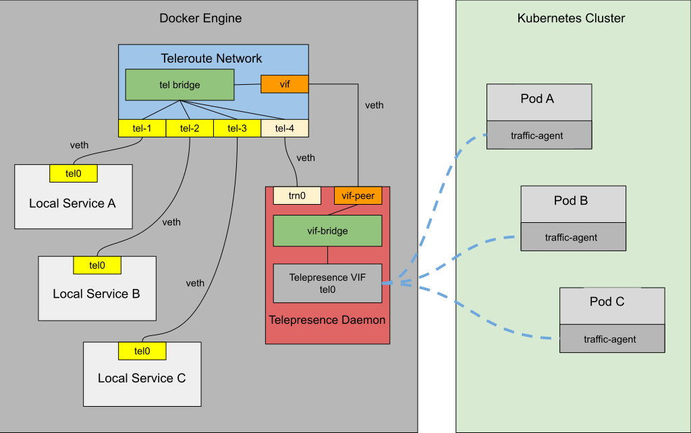

# Telepresence Docker Plug-ins

A Telepresence client started with `telepresence connect --docker` will run in a Docker container. This is great because
it means that the network that it creates, and the volumes that it mounts, will not interfere with the network and
mounts on the workstation. Thanks to the Docker plugins Teleroute and Telemount, it also means that those resources are
available to other containers in the form of a Docker network and as Docker volumes.

## Teleroute Network Plugin
The Telepresence Teleroute Docker network plugin is installed on demand and ensures that the cluster networks made
available by the daemon's virtual network interface (VIF) can be reached from other containers without interfering
with those container's network mode.

### Technical brief

This is the sequence of events that occur when the user runs `telepresence connect --docker`:

1. A check is made if the Teleroute network plugin is present. If not, it is installed automatically[^1].
2. The Telepresence daemon is started using the default bridge network, so that an IP address is assigned to it that the
   Teleroute network plugin can connect to.
3. A Teleroute network is created using `docker create network --driver=teleroute`. The network is configured to
   connect to the Telepresence daemon's teleroute gRPC service using the daemon's IP address on the default bridge[^2].
   The network driver creates a "tel" bridge and a "vif" veth pair at the plugin's side. One side of this pair is then
   told to use the "tel" bridge as its master and its peer is moved to the daemon's network namespace (logically
   equivalent to moving it into the daemon's container).
4. The plugin informs the daemon about the added veth endpoint.
5. The daemon creates a "vif" bridge, that it assigns as the master of both its own VIF and the added endpoint. The
   VIF is now wired to the "tel" bridge in the plugin.
6. The daemon connects to the teleroute network, so that it can make future connections to other containers connected
   to that network.

When Telepresence starts a docker container, either by using `telepresence curl`, `telepresence docker-run` commands, or
by using the `--docker-{run|build|debug}` flag in an engagement command, the following happens:

1. The container will automatically be connected to the teleroute network.
2. The container will get its DNS configured to use the DNS server exposed by the Telepresence daemon.
3. The teleroute network driver creates a "tel" veth pair and connects one of its endpoints to the "tel" bridge.
4. Docker ensures that the peer endpoint is moved to the connecting container, where it routes the same subnets
   as the VIF in the Telepresence daemon. In other words, since that endpoint is now fully wired to route traffic via
   the VIF, the container now has access to the cluster resources.

Picture showing a Teleroute network connected to a daemon container and three local services

## Telemount Volume Plugin

The Telepresence Telemount Docker volume plugin is installed on demand and ensures that remote directories that are made
available by SFTP-servers in the traffic-agents can be mounted as Docker volumes. The driver is configured when a
containerized Telepresence daemon is started, so that volumes can be created when Telepresence engages with a remote
container using `telepresence {ingest|intercept|replace|wiretap}`. These commands make a port available in the daemon
that connects the network driver with the remote SFTP-server.

This is the sequence of events that occur when the user runs `telepresence connect --docker`:

1. A check is made if the Telemount volume plugin is present. If not, it is installed automatically[^3].
2. The daemon configures itself to use a bridge mounter. This mounter is just a proxy that makes the port used by a
   remote traffic-agent's SFTP server available on the daemon containers localhost.

When Telepresence engages a container using the `--docker-{run|build|debug}` flag in an engagement command, the 
following happens:

1. A full list of volumes to be mounted is established. The command options are scanned for `-v`, `--volume` and
   `--mount` flags, and those flags are then merged with the mounts propagated from the traffic-agent of the engaged
   pod. The command options are given priority in this merge.
2. A `docker create volume --driver=telemount` is executed for each volume in the list, passing the port number of the
   proxied SFTP server to the volume plugin.
3. The container is started with `-v` flags appointing the newly created volumes.
4. The telemount performs SFTP mounts of the volumes, as needed.

When the container engagement ends, the volumes are unmounted and removed, and the telepresence daemon closes the
SFTP proxy.

[^1]: The plugin registry, name, and tag can be fully configured using the `intercept.teleroute` in the `config.yml`
      configuration file.

[^2]: The default port used for this connection is 4039, but it can be reconfigured using the `grpc.teleroutePort` in
      the `config.yml` configuration file.

[^3]: The plugin registry, name, and tag can be fully configured using the `intercept.telemount` in the `config.yml`
configuration file.
