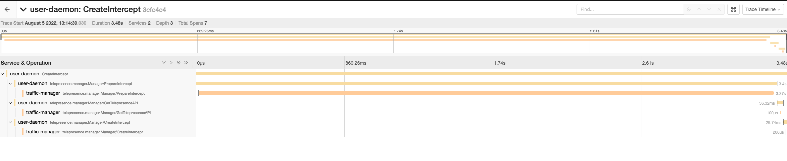

# Troubleshooting


## Creating an intercept did not generate a preview URL

Preview URLs can only be created if Telepresence is [logged in to
Ambassador Cloud](../reference/client/login/).  When not logged in, it
will not even try to create a preview URL (additionally, by default it
will intercept all traffic rather than just a subset of the traffic).
Remove the intercept with `telepresence leave [deployment name]`, run
`telepresence login` to login to Ambassador Cloud, then recreate the
intercept.  See the [intercepts how-to doc](../howtos/intercepts) for
more details.

## Error on accessing preview URL: `First record does not look like a TLS handshake`

The service you are intercepting is likely not using TLS, however when configuring the intercept you indicated that it does use TLS. Remove the intercept with `telepresence leave [deployment name]` and recreate it, setting `TLS` to `n`. Telepresence tries to intelligently determine these settings for you when creating an intercept and offer them as defaults, but odd service configurations might cause it to suggest the wrong settings.

## Error on accessing preview URL: Detected a 301 Redirect Loop

If your ingress is set to redirect HTTP requests to HTTPS and your web app uses HTTPS, but you configure the intercept to not use TLS, you will get this error when opening the preview URL.  Remove the intercept with `telepresence leave [deployment name]` and recreate it, selecting the correct port and setting `TLS` to `y` when prompted.

## Connecting to a cluster via VPN doesn't work.

There are a few different issues that could arise when working with a VPN. Please see the [dedicated page](../reference/vpn) on Telepresence and VPNs to learn more on how to fix these.

## Connecting to a cluster hosted in a VM on the workstation doesn't work

The cluster probably has access to the host's network and gets confused when it is mapped by Telepresence.
Please check the [cluster in hosted vm](../howtos/cluster-in-vm) for more details.

## Volume mounts are not working on macOS

It's necessary to have `sshfs` installed in order for volume mounts to work correctly during intercepts. Lately there's been some issues using `brew install sshfs` a macOS workstation because the required component `osxfuse` (now named `macfuse`) isn't open source and hence, no longer supported. As a workaround, you can now use `gromgit/fuse/sshfs-mac` instead. Follow these steps:

1. Remove old sshfs, macfuse, osxfuse using `brew uninstall`
2. `brew install --cask macfuse`
3. `brew install gromgit/fuse/sshfs-mac`
4. `brew link --overwrite sshfs-mac`

Now sshfs -V shows you the correct version, e.g.:
```
$ sshfs -V
SSHFS version 2.10
FUSE library version: 2.9.9
fuse: no mount point
```

5. Next, try a mount (or an intercept that performs a mount). It will fail because you need to give permission to “Benjamin Fleischer” to execute a kernel extension (a pop-up appears that takes you to the system preferences).
6. Approve the needed permission
7. Reboot your computer.

## Volume mounts are not working on Linux
It's necessary to have `sshfs` installed in order for volume mounts to work correctly during intercepts.

After you've installed `sshfs`, if mounts still aren't working:
1. Uncomment `user_allow_other` in `/etc/fuse.conf`
2. Add your user to the "fuse" group with: `sudo usermod -a -G fuse <your username>`
3. Restart your computer after uncommenting `user_allow_other` 

## Distributed tracing

Telepresence is a complex piece of software with components running locally on your laptop and remotely in a distributed kubernetes environment.
As such, troubleshooting investigations require tools that can give users, cluster admins, and maintainers a broad view of what these distributed components are doing.
In order to facilitate such investigations, telepresence >= 2.7.0 includes distributed tracing functionality via [OpenTelemetry](https://opentelemetry.io/)
Tracing is controlled via a `grpcPort` flag under the `tracing` configuration of your `values.yaml`. It is enabled by default and can be disabled by setting `grpcPort` to `0`, or `tracing` to an empty object:

```yaml
tracing: {}
```

If tracing is configured, the traffic manager and traffic agents will open a GRPC server under the port given, from which telepresence clients will be able to gather trace data.
To collect trace data, ensure you're connected to the cluster, perform whatever operation you'd like to debug and then run `gather-traces` immediately after:

```console
$ telepresence gather-traces
```

This command will gather traces from both the cloud and local components of telepresence and output them into a file called `traces.gz` in your current working directory:

```console
$ file traces.gz
    traces.gz: gzip compressed data, original size modulo 2^32 158255
```

Please do not try to open or uncompress this file, as it contains binary trace data.
Instead, you can use the `upload-traces` command built into telepresence to send it to an [OpenTelemetry collector](https://opentelemetry.io/docs/collector/) for ingestion:

```console
$ telepresence upload-traces traces.gz $OTLP_GRPC_ENDPOINT
```

Once that's been done, the traces will be visible via whatever means your usual collector allows. For example, this is what they look like when loaded into Jaeger's [OTLP API](https://www.jaegertracing.io/docs/1.36/apis/#opentelemetry-protocol-stable):



**Note:** The host and port provided for the `OTLP_GRPC_ENDPOINT` must accept OTLP formatted spans (instead of e.g. Jaeger or Zipkin specific spans) via a GRPC API (instead of the HTTP API that is also available in some collectors)
**Note:** Since traces are not automatically shipped to the backend by telepresence, they are stored in memory. Hence, to avoid running telepresence components out of memory, only the last 10MB of trace data are available for export.

### No Sidecar Injected in GKE private clusters

An attempt to `telepresence intercept` results in a timeout, and upon examination of the pods (`kubectl get pods`) it's discovered that the intercept command did not inject a sidecar into the workload's pods:

```bash
$ kubectl get pod
NAME                         READY   STATUS    RESTARTS   AGE
echo-easy-7f6d54cff8-rz44k   1/1     Running   0          5m5s

$ telepresence intercept echo-easy -p 8080
telepresence: error: connector.CreateIntercept: request timed out while waiting for agent echo-easy.default to arrive
$ kubectl get pod
NAME                        READY   STATUS    RESTARTS   AGE
echo-easy-d8dc4cc7c-27567   1/1     Running   0          2m9s

# Notice how 1/1 containers are ready.
```

If this is occurring in a GKE cluster with private networking enabled, it is likely due to firewall rules blocking the
Traffic Manager's webhook injector from the API server.
To fix this, add a firewall rule allowing your cluster's master nodes to access TCP port `443` in your cluster's pods,
or change the port number that Telepresence is using for the agent injector by providing the number of an allowed port
using the Helm chart value `agentInjector.webhook.port`.
Please refer to the [telepresence install instructions](../install/cloud#gke) or the [GCP docs](https://cloud.google.com/kubernetes-engine/docs/how-to/private-clusters#add_firewall_rules) for information to resolve this.

## Injected init-container doesn't function properly

The init-container is injected to insert `iptables` rules that redirects port numbers from the app container to the
traffic-agent sidecar. This is necessary when the service's `targetPort` is numeric. It requires elevated privileges
(`NET_ADMIN` capabilities), and the inserted rules may get overridden by `iptables` rules inserted by other vendors,
such as Istio or Linkerd.

Injection of the init-container can often be avoided by using a `targetPort` _name_ instead of a number, and  ensure
that  the corresponding container's `containerPort` is also named. This example uses the name "http", but any valid
name will do:
```yaml
apiVersion: v1
kind: Pod
metadata:
  ...
spec:
  ...
  containers:
    - ...
      ports:
      - name: http
        containerPort: 8080
---
apiVersion: v1
kind: Service
metadata:
  ...
spec:
  ...
  ports:
    - port: 80
      targetPort: http
```

Telepresence's mutating webhook will refrain from injecting an init-container when the `targetPort` is a name.  Instead,
it will do the following during the injection of the traffic-agent:

1. Rename the designated container's port by prefixing it (i.e., containerPort: http becomes containerPort: tm-http).
2. Let the container port of our injected traffic-agent use the original name (i.e., containerPort: http).

Kubernetes takes care of the rest and will now associate the service's `targetPort` with our traffic-agent's
`containerPort`.

### Important note
If the service is "headless" (using `ClusterIP: None`), then using named ports won't help because the `targetPort` will
not get remapped. A headless service will always require the init-container.

## Error connecting to GKE or EKS cluster

GKE and EKS require a plugin that utilizes their resepective IAM providers. 
You will need to install the [gke](../install/cloud#gke-authentication-plugin) or [eks](../install/cloud#eks-authentication-plugin) plugins 
for Telepresence to connect to your cluster.

## `too many files open` error when running `telepresence connect` on Linux

If `telepresence connect` on linux fails with a message in the logs `too many files open`, then check if `fs.inotify.max_user_instances` is set too low. Check the current settings with `sysctl fs.notify.max_user_instances` and increase it temporarily with `sudo sysctl -w fs.inotify.max_user_instances=512`. For more information about permanently increasing it see [Kernel inotify watch limit reached](https://unix.stackexchange.com/a/13757/514457).

## Connected to cluster via VPN but IPs don't resolve

If `telepresence connect` succeeds, but you find yourself unable to reach services on your cluster, a routing conflict may be to blame. This frequently happens when connecting to a VPN at the same time as telepresence,
as often VPN clients may add routes that conflict with those added by telepresence. To debug this, pick an IP address in the cluster and get its route information. In this case, we'll get the route for `100.124.150.45`, and discover
that it's running through a `tailscale` device.

<Platform.TabGroup>
<Platform.MacOSTab>

```console
$ route -n get 100.124.150.45
   route to: 100.64.2.3
destination: 100.64.0.0
       mask: 255.192.0.0
  interface: utun4
      flags: <UP,DONE,CLONING,STATIC>
 recvpipe  sendpipe  ssthresh  rtt,msec    rttvar  hopcount      mtu     expire
       0         0         0         0         0         0      1280         0
```

Note that in macos it's difficult to determine what software the name of a virtual interface corresponds to -- `utun4` doesn't indicate that it was created by tailscale.
One option is to look at the output of `ifconfig` before and after connecting to your VPN to see if the interface in question is being added upon connection

</Platform.MacOSTab>
<Platform.GNULinuxTab>

```console
$ ip route get 100.124.150.45
100.64.2.3 dev tailscale0 table 52 src 100.111.250.89 uid 0
```

</Platform.GNULinuxTab>
<Platform.WindowsTab>

```console
$ Find-NetRoute -RemoteIPAddress 100.124.150.45

IPAddress         : 100.102.111.26
InterfaceIndex    : 29
InterfaceAlias    : Tailscale
AddressFamily     : IPv4
Type              : Unicast
PrefixLength      : 32
PrefixOrigin      : Manual
SuffixOrigin      : Manual
AddressState      : Preferred
ValidLifetime     : Infinite ([TimeSpan]::MaxValue)
PreferredLifetime : Infinite ([TimeSpan]::MaxValue)
SkipAsSource      : False
PolicyStore       : ActiveStore


Caption            : 
Description        : 
ElementName        : 
InstanceID         : ;::8;;;8<?:8BC9=<55<C55:8:8:8:55;
AdminDistance      : 
DestinationAddress : 
IsStatic           : 
RouteMetric        : 0
TypeOfRoute        : 3
AddressFamily      : IPv4
CompartmentId      : 1
DestinationPrefix  : 100.124.150.45/32
InterfaceAlias     : Tailscale
InterfaceIndex     : 29
InterfaceMetric    : 5
NextHop            : 0.0.0.0
PreferredLifetime  : 10675199.02:48:05.4775807
Protocol           : NetMgmt
Publish            : No
State              : Alive
Store              : ActiveStore
ValidLifetime      : 10675199.02:48:05.4775807
PSComputerName     : 
ifIndex            : 29
```

</Platform.WindowsTab>
</Platform.TabGroup>

This will tell you which device the traffic is being routed through. As a rule, if the traffic is not being routed by the telepresence device,
your VPN may need to be reconfigured, as its routing configuration is conflicting with telepresence. One way to determine if this is the case
is to run `telepresence quit -s`, check the route for an IP in the cluster (see commands above), run `telepresence connect`, and re-run the commands to see if the output changes.
If it doesn't change, that means telepresence is unable to override your VPN routes, and your VPN may need to be reconfigured. Talk to your network admins
to configure it such that clients do not add routes that conflict with the pod and service CIDRs of the clusters. How this will be done will
vary depending on the VPN provider.
Future versions of telepresence will be smarter about informing you of such conflicts upon connection.
