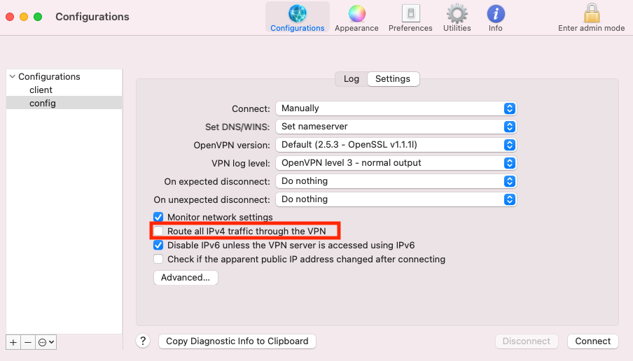
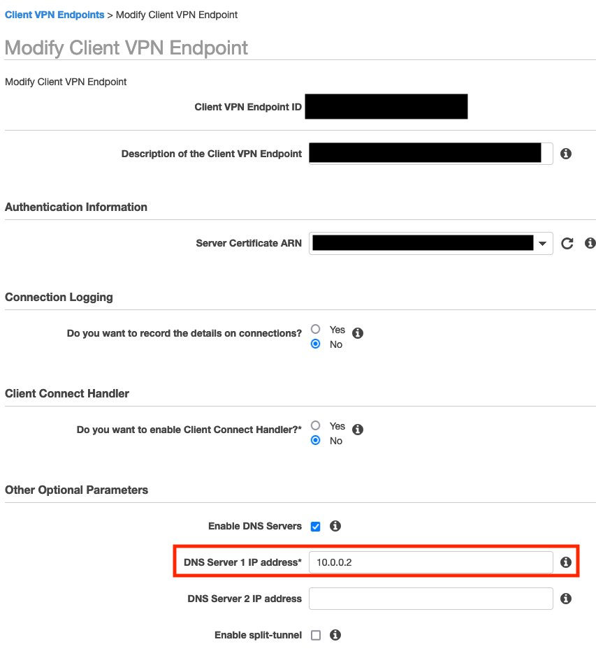

<!-- TODO: We should figure out a way to make this site-wide without affecting the release notes page -->
<div class="container">

# Telepresence and VPNs

## The test-vpn command

You can make use of the `telepresence test-vpn` command to diagnose issues
with your VPN setup.
This guides you through a series of steps to figure out if there are
conflicts between your VPN configuration and telepresence.

### Prerequisites

Before running `telepresence test-vpn` you should ensure that your VPN is
in split-tunnel mode.
This means that only traffic that _must_ pass through the VPN is directed
through it; otherwise, the test results may be inaccurate.

You may need to configure this on both the client and server sides.
Client-side, taking the Tunnelblick client as an example, you must ensure that
the `Route all IPv4 traffic through the VPN` tickbox is not enabled:



Server-side, taking AWS' ClientVPN as an example, you simply have to enable
split-tunnel mode:


In AWS, this setting can be toggled without reprovisioning the VPN. Other cloud providers may work differently.

### Testing the VPN configuration

To run it, enter:

```console
$ telepresence test-vpn
```

The test-vpn tool begins by asking you to disconnect from your VPN; ensure you are disconnected then
press enter:

```
Telepresence Root Daemon is already stopped
Telepresence User Daemon is already stopped
Please disconnect from your VPN now and hit enter once you're disconnected...
```

Once it's gathered information about your network configuration without an active connection,
it will ask you to connect to the VPN:

```
Please connect to your VPN now and hit enter once you're connected...
```

It will then connect to the cluster:


```
Launching Telepresence Root Daemon
Launching Telepresence User Daemon
Connected to context arn:aws:eks:us-east-1:914373874199:cluster/josec-tp-test-vpn-cluster (https://07C63820C58A0426296DAEFC73AED10C.gr7.us-east-1.eks.amazonaws.com)
Telepresence Root Daemon quitting... done
Telepresence User Daemon quitting... done
```

And show you the results of the test:

```
---------- Test Results:
❌ pod subnet 10.0.0.0/19 is masking VPN-routed CIDR 10.0.0.0/16. This usually means Telepresence will be able to connect to your cluster, but hosts on your VPN may be inaccessible while telepresence is connected; to resolve:
        * Move pod subnet 10.0.0.0/19 to a subnet not mapped by the VPN
                * If this is not possible, ensure that any hosts in CIDR 10.0.0.0/16 are placed in the never-proxy list
✅ svc subnet 10.19.0.0/16 is clear of VPN

Please see https://www.telepresence.io/docs/latest/reference/vpn for more info on these corrective actions, as well as examples

Still having issues? Please create a new github issue at https://github.com/telepresenceio/telepresence/issues/new?template=Bug_report.md
 Please make sure to add the following to your issue:
 * Run `telepresence loglevel debug`, try to connect, then run `telepresence gather_logs`. It will produce a zipfile that you should attach to the issue.
 * Which VPN client are you using?
 * Which VPN server are you using?
 * How is your VPN pushing DNS configuration? It may be useful to add the contents of /etc/resolv.conf
```

#### Interpreting test results

##### Case 1: VPN masked by cluster

In an instance where the VPN is masked by the cluster, the test-vpn tool informs you that a pod or service subnet is masking a CIDR that the VPN
routes:

```
❌ pod subnet 10.0.0.0/19 is masking VPN-routed CIDR 10.0.0.0/16. This usually means Telepresence will be able to connect to your cluster, but hosts on your VPN may be inaccessible while telepresence is connected; to resolve:
        * Move pod subnet 10.0.0.0/19 to a subnet not mapped by the VPN
                * If this is not possible, ensure that any hosts in CIDR 10.0.0.0/16 are placed in the never-proxy list
```

This means that all VPN hosts within `10.0.0.0/19` will be rendered inaccessible while
telepresence is connected.

The ideal resolution in this case is to move the pods to a different subnet. This is possible,
for example, in Amazon EKS by configuring a [new CIDR range](https://aws.amazon.com/premiumsupport/knowledge-center/eks-multiple-cidr-ranges/) for the pods.
In this case, configuring the pods to be located in `10.1.0.0/19` clears the VPN and allows you
to reach hosts inside the VPC's `10.0.0.0/19`

However, it is not always possible to move the pods to a different subnet.
In these cases, you should use the [never-proxy](../config#neverproxy) configuration to prevent certain
hosts from being masked.
This might be particularly important for DNS resolution. In an AWS ClientVPN VPN it is often
customary to set the `.2` host as a DNS server (e.g. `10.0.0.2` in this case):



If this is the case for your VPN, you should place the DNS server in the never-proxy list for your
cluster. In your kubeconfig file, add a `telepresence` extension like so:

```yaml
- cluster:
    server: https://127.0.0.1
    extensions:
    - name: telepresence.io
      extension:
        never-proxy:
        - 10.0.0.2/32
```

##### Case 2: Cluster masked by VPN

In an instance where the Cluster is masked by the VPN, the test-vpn tool informs you that a pod or service subnet is being masked by a CIDR
that the VPN routes:

```
❌ pod subnet 10.0.0.0/8 being masked by VPN-routed CIDR 10.0.0.0/16. This usually means that Telepresence will not be able to connect to your cluster. To resolve:
        * Move pod subnet 10.0.0.0/8 to a subnet not mapped by the VPN
                * If this is not possible, consider shrinking the mask of the 10.0.0.0/16 CIDR (e.g. from /16 to /8), or disabling split-tunneling
```

Typically this means that pods within `10.0.0.0/8` are not accessible while the VPN is
connected.

As with the first case, the ideal resolution is to move the pods away, but this may not always
be possible. In that case, your best bet is to attempt to shrink the VPN's CIDR
(that is, make it route more hosts) to make Telepresence's routes win by virtue of specificity.
One easy way to do this may be by disabling split tunneling (see the [prerequisites](#prerequisites)
section for more on split-tunneling).

Note that once you fix this, you may find yourself landing again in [Case 1](#case-1-vpn-masked-by-cluster), and may need
to use never-proxy rules to whitelist hosts in the VPN:

```
❌ pod subnet 10.0.0.0/8 is masking VPN-routed CIDR 0.0.0.0/1. This usually means Telepresence will be able to connect to your cluster, but hosts on your VPN may be inaccessible while telepresence is connected; to resolve:
        * Move pod subnet 10.0.0.0/8 to a subnet not mapped by the VPN
                * If this is not possible, ensure that any hosts in CIDR 0.0.0.0/1 are placed in the never-proxy list
```
</div>
